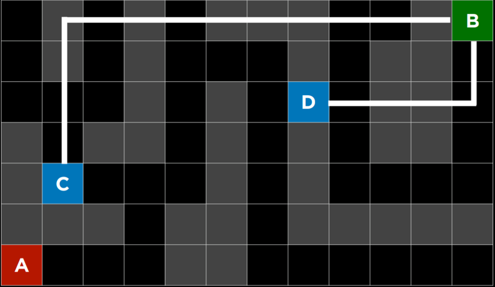
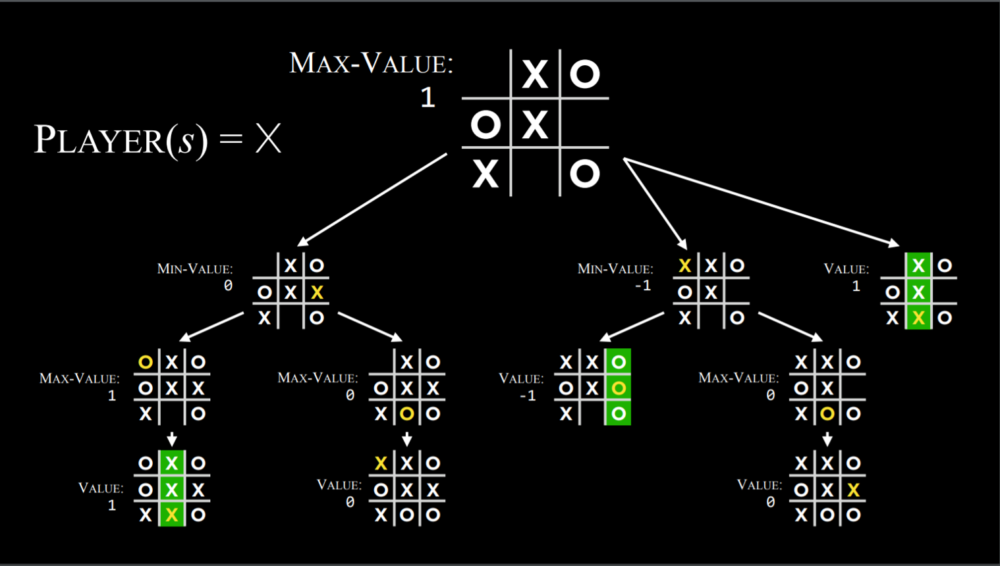
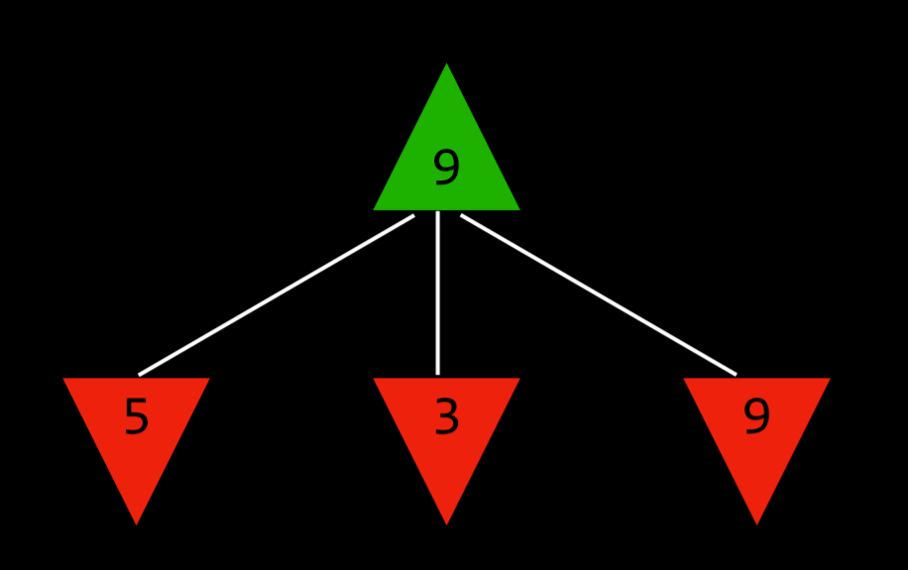
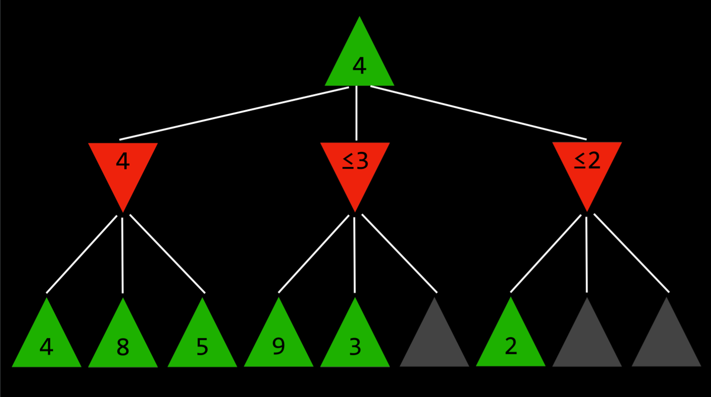

# CS50 AI WEEK 0

## SEARCH

- This is where you want ai to find the solution to a problem.
- I want my ai agent to be able to solve any problem it is presented with.
- Examples of search problems are puzzles and mazes where you have a 'start state: state in which you begin solving the problem. And and end state : the goal or completed poduct.

## Terminology

### __Agent__

- This is an entity(program) that perceives its environment and acts upon that environment.(eg an autonomous car)

### __State__

- Basically this is the current state of an agent in its environment at a particular time.This is just some configuration of the env which may require different actions to solve in comparison with a different state.
  __Initial State__:
  - This is the state in which the agent begins.
  - This is the point at which our search algo starts and where we have to make decisions on what were going to do to get from the beginning to the end state.

### __Actions__

- These are the things that the agent can do in the environment to get from the initial state to the goal.
- In AI we need to define actions more precisely so that they are programmable.
- That is we need to translate ideas into actions and actions into some sort of mathematically actionable format that can be programmed into our models.
- In this way we can define actions as a function that takes as input state *s*:
  *actions(s)* returns/outputs the  set of actions that can be executed in state *s*.
- Some actions may be valid in some states and not in other states.

### __Transition Model__

- This is a description of what state is reached by taking some available action in the current state or some other state.
- Basically this is "if i do this, what will happen, what will the result be"
- This transition model has to be formally defined as a function.:
  *result  (s,a)* returns/outputs the next state *s'* that results from taking action *a* in state *s*.
- A transition model needs to understand how to take a state and an action then return a result of the action on the state.

### __State Space__

- This is a set of all reachable states from the initial state by any sequence of actions.
- This is gotten by applying a transition model on all possible actions in all possible states from an original state in the environment.
- This is like a tree from the original state to all possible states reachable through actions.
- This can be simply represented as a graph where each node is a state and each edge is an action taking us from one state to the next.

### __Goal Test__

- This is a function that determines whether a given state is the goal state or not.
- Some problems may have one goal and others multiple possibilities.

### __Path Cost__

- Sometimes it is not only necessary to achieve the goal by any means necessary but to find the goal well with little cost.
- This is the cost of taking a particular path from the initial state to a goal state.
- Every path has to have some sort of numerical cost.
- This tells the ai the expense of taking a particular path over an other
- Therefore instead of just getting an answer you gan tell the ai to minimise the path cost to getting to the solution.
- In a graph this can be represented as a weighted edge where each path has a cost associated with it.

### __Solution__

- This is a sequence of actions that leads from the initial state to the goal state
  __Optimal Solution__:
- This is the solution that has the lowest path cost among all solutions.

__Node__:

- A data structure that keeps track of the following values :

  1. The *state* of the node
  2. The *parent node*(the node that generated this node)- this is for the point of backtracking the actions taken if we achieve the goal node.
  3. An *action*(actions applied to parent to get node)
  4. *Path cost*( from initial state to current node)

  - Nodes only hold info, they dont do anything more

## __Approach__

- We start at a particular state and explore.
- From a given state we have some available options, and from those options, others make themselves available.
  __Frontier__:

  - This is a data structure where all available unexplored options are stored.

    ```python
    1. So we start with a frontier that contains the *initial* state.
    2. Start with an empty explored set(a list or dict)
    3. **Repeat**:
    If the frontier is empty:
    there is no solution.
    Else:
    *Select/remove* a node from the frontier.(node is current consideration)
    If the node contains the goal state:
    We have found a solution.
    Else:
    Add current node to the *explored set*( to avoid repeating nodes)
    Expand the node( look at all possible actions from the current node) and add the resulting nodes to the frontier(*if thet arent already in the frontier or the explored set*).(expanding is like branching)
    ```

- For removing nodes from the frontier its important how we structure the frontier.(how we add and remove nodes)
- This has implications on the quality of the selution and how fast it is achieved.

### __Depth First Search__

- In a depth first search, we explore the deepest node first and when we dont find the goal state we backtrack.
  __stack__:

  - LIFO(*last in first out*)
  - The last node added to the frontier is the first one we explore.
- In depth first search as long as the nodes are finite, we will always find a solution if one exists but it may *not be the optimal solution*.(we will exhaust all possibilities in the end)
- If the search is infinite, then we may never find a solution.
- *At worst* this algo explores all paths before finding the solution thus taking the *longest path* to reach the solution.
- *At best* this algo finds the solution in the first path it explores, therefore it becomes the *fastest*.
- In depth first search we may save memory because we eliminate useless paths/nodes
- Code example of a depth first search approach:

  ```python
      # Define the function that removes a node from the frontier and returns it.
      def remove(self):
          # Terminate the search if the frontier is empty, because this means that there is no solution.
          if self.empty():
              raise Exception("empty frontier")
          else:
              # Save the last item in the list (which is the newest node added)
              node = self.frontier[-1]
              # Save all the items on the list besides the last node (i.e. removing the last node)
              self.frontier = self.frontier[:-1]
              return node

  ```

### __Breadth First Search__

- In breadth first search we explore the shallowest node in the frontier.
- Instead of using a stack, we use a queue
  __queue__:
  -FIFO(*first in first out data type*)

  - The first node added to the frontier is the first one we explore
  - This is like on a first come first served basis.
  - We explore all nodes at a given depth before moving to the next depth level.
  - This is like levels where we finish all tasks in one level before moving to the next.
- Whereas in depth first search we chose one path and exhausted it, in breadth first search we explore *all* paths/options at a given depth before moving to the next depth level.
- With this shallow first approach, we are more likely to find the most optimal solution but may have to incur the cost of memory if the frontier is large.
- We will also have to explore many useless paths but we will find the solution faster than in depth first search.
- *At worst* this algo will explore many useless nodes before finding the solution thus taking the *longest* possible *time*.
- *At best* this algo is *guranteed* to find the most *optimal solution*
- This is very memory intensive because we consider all nodes in the frontier untill the goal is reached.
- Code example of a breadth first search approach:

  ```python
      # Define the function that removes a node from the frontier and returns it.
      def remove(self):
          # Terminate the search if the frontier is empty, because this means that there is no solution.
          if self.empty():
              raise Exception("empty frontier")
          else:
              # Save the oldest item on the list (which was the first one to be added)
              node = self.frontier[0]
              # Save all the items on the list besides the first one (i.e. removing the first node)
              self.frontier = self.frontier[1:]
              return node
  ```

- As of now it seems that the most optimal solution is the breadth first search which finds the path with the lowest cost to the goal.
- However this algo is very memory and time intensive when searching.
- What we would like is for our algo to be a little more intelligent in finding the solution. For example: as a human, when solving a maze, from intuition we always choose to move to the cell closer to the goal, though it may not be correct we reduce the number of paths we have to take in order to get to the goal by eliminating paths that lead away from it.
- The breadth first search can borrow this same intuition and ignore all branches that lead away from the goal.
- If the starting and end point are on a grid we can measure the distance form each node to the goal state and determine whether it is getting us closer of farther away, thus eliminatind the need to explore useless nodes and increasing our speed to solution.
- For this intuition though we make a couple assumptions:

  1. We assume that we can rep the object as a 2d grid and all nodes have coordinates including the start and goal.

From this we can infer there are two different types of search algorithms:

1. __Uninformed Search__:
   - This is when we don't have any information about the problem domain.
   - These are live Breadth first search and Depth first search.
   - These algorims are not very efficient and are used when we don't have any information about the problem we are trying to solve therefore no context at to how to solve the problem at hand.
2. __Informed Search__:
   - These are search strategies that use knowledge specific to the problem at hand to help solve it more efficiently.
   - For this type of search we have context to be able to base our ideas off of.
   - This helps achieve faster solutions more efficiently.
   - Informed search is like having an intuition.

## __Informed search__

### __Greedy Best-First search__:(gbfs)

- This is a search algorithm that expands the node that it thinks is closest to the goal as estimated by a *heuristic* function.
- This heuristic function doesnt know for sure if the node is closer to the goal, it estimate.
- The speed/efficiency of this function depends on how good the heuristic function is.
- The heuristic function *__h(n)__* takes state *n* as input and returns as output an estimate of how far it thinks *n* is from the goal.
- In a maze problem for example, when given two points , we can relax the problem and ignore the walls. From the locations of the two points we can therefore infer the distance from the goal and thus choose the path that is closer to the goal.
- This is called the  *__Manhattan distance__*:
  counts how many steps up , down, or to the side it would take to get from one location to the goal location by using (x,y) coordinates.
- This manhattan dist would be our heuristic function giving each node a value that is an estimate of how far it is from the goal.
- 
- It is good to note however that by relaxing the problem we open ourselves up to the possibility of choosing a wrong path which may seem shorter.
- The heuristic isnt a gurantee but an estimate.
- We might go down a slower path but we are guaranteed to find the goal eventually because we constantly compare our current path to the estimated path and choose the one that is closer to the goal.

- This algo doesnt care what order the nodes are added to the frontier, it just cares about the estimated distance to the goal.The node with the least wins and is explored first.
- Whith this algo we disregard unnecessary nodes thus saving space and time.
- *A good question to ask when building algos is:*
- *__is this algorithm optimal?__* *will it always find the __shortest__ path to goal?*
- With __GBFS__ we may sometimes end up with a less optimal path to the solution which seemed shorter at a certain point but ends up being longer in the end and there was a better solution.
- We can modify __GBFS__ to handle cases like these.
- We can add a function that checks for the cost incurred to reach a certain state in comparison with an other similar state that may cost less.

### __A* search__

- This is a modification of the *greedy best-first search*.
- This search algo expands the node with the lowest value of __g(n) + h(n)__
- __g(n)__: the cost accrued to reach current node.(*how far did i have to travel to get here*)
- __h(n)__: estimated distance from curreent node to the goal(*how far am i from the goal*)(this is the heuristic value)
- Therefore instead of noly considering the estimated distance from the goal which may lead us down a long inefficient path, we include the cost to get here and therefore avoid going down long inefficient paths.
- The total value of each node becomes the sum of the cost of getting to the node and how far i am from the goal.
- The way it works better is if i take to many steps(cost) to arrive at a certain node and there is one that has a lower cost, we opt for the one with the lower cost thus achieving the most optimal path to goal.
- This algorithm can only be as good as the heuristic it employs.
  - For __A* search__ to be optimal, the heuristic function should be:
    1. *Admissible*: never overestimate the true cost(either gets it right or underestimates it)
    2. *Consistent*: for every node __n__ and successor __n`__ wih step cost __c__, *__h(n) ≤ h(n') + c__*
- This search algorithm is however known to use quite a bit of memory so it is subject for further refinement.

## __Adversarial Search__

- While proviously our algorithms are trying to find an answer to a question, in __adversarial search__ the algo faces an oppenent that tries to counter the search by achieving the opposite goal.
- In *adverserial search* it is like playing a two player game where either person can win or end in a tie.
- So here we ask the question *what does an intelligent decision in a game look like*
- For this we are going to take an example game of *tic tac toe*

### __Minimax__

- This is an algorithm that works well with deterministic games that requries adversarial search.
- For this we need to find a way to translate a game like tic tac toe into a language the computers understand. This is translating a game to summ numerical.
- Deterministic games are games with two playwes where i moove then my opponent mooves.
- The only way to win these game is either i win, you win or we tie.
- Therefore like in tic tac to either O wins or X wins or we tie.
- For each possible outcome we can assign a value:

  - O winning = -1 (*min player*)
  - X winning = +1 (*max player*)
  - Draw      = 0
- From the above assignment, the max player aims to maximise the score while O aims to minimise the score. Therefore forming the notion of a *minimax* algo.
- The following is a way to represent a game of tic tac toe in an algorithm.

__Game__:

1. __S₀__ : Initial state
2. __Players(s)__: takes a *state __s__* as input and returns which player's turn it is.
3. __Actions(s)__: takes a *state __s__* as input and returns all possible moves in this state.(as a list)
4. __Result(s,a)__: takes a *state __s__* and an *action __a__* as input and returns a new state.(result of action a on state s)(*transition model*)
5. __Terminal(s)__: takes a *state __s__* as input and returns true if the game is over and false otherwise.
6. __Utility(s)__: takes a *state __s__* as input and returns the utility(value/score) of this state(__-1, 0, or 1__).

__How the algo works__:

- *Recursively* the algorithm stimulates all possible games that can take place beginning at current state until a terminal state is reached.



- The question now becomes how do get the value of a current state without knowing how the game ends and therefore choose the best path to either minimise or maximize the score.
- Through running through the recursion to the terminal state i am able to see which sequence of moves can lead to a win, loss or draw. Therefor i can infer that beginning at the current state the best move is the one that leads to the best possible outcome of a desired goal.
- Through recursivety the algo places itself in its opponents shoes and tries to find the best possible move to counter the opponents move.
- Minimax's logic essentially is considering all possible options and choosing the safest route to its goal.
- Its like a tree that with each decision grows deeper until either a win or a draw.
- The following is a more abstract version of the minimax tree.
  
  The green arrows are maximising states
  The red arrows are minimising states.
From the three choices privided above , the green player chooses the option with the maximum value to maximize his chances of winning.

- in this method the min player considers the maximum that the max palyer can get on their next turn and chooses the node with the smallest max value.
- The maximum player considers the minimum that the min player can get on their next turn and chooses the node with the largest min value.
- This method forces the opponent to play a game dictated by the higher player(algo)

__Minimax pseudo code__:

Given a state *s*:

-The *maximizing* player picks *action a* in *Actions(s)* that produces the *highest* value of *__Min-Value(Result(s, a))__*.
-The *minimizing* player picks *action a* in *Actions(s)* that produces the *lowest* value of *__Max-Value(Result(s, a))__*.

```python
    Function Max-Value(state)

        v = -∞

        if Terminal(state):
        ​    return Utility(state)

        for action in Actions(state):#for each action available in the current state
        ​    v = Max(v, Min-Value(Result(state, action)))
            return v

    Function Min-Value(state):

        v = ∞

        if Terminal(state):
        ​    return Utility(state)

        for action in Actions(state):
        ​    v = Min(v, Max-Value(Result(state, action)))
            return v
```

- As for all algorithms we have to ask:
     *__is this algorithm optimal?__* *will it always find the __shortest__ path to goal?*

- A good way to do this is to look at the process of how the algo works and optimise from there.

### __Alpha-Beta Pruning__

- Although minimax is a very good algorithm it has a major drawback: it is very slow and memory intensive because it has to explore all possible moves.
- With minimax if i am playing as the maximizing player, i can never gurantee a higher score than the lowest possible score in my opponent's next move.
- The lowest score in any subsequent node is hypothetically guranteed, therefore i will often go for the node(not with the highest max score) but with the highest min score of all available nodes.
- *In alpha beta pruning, we skip some of the recursive computations that are __guaranteed__ to be suboptimal.*
- Say i have a state *s* and i am playing as a maximizing player
- I explore the frirst branch of *s* and find that the min value is 4.
- Any subsequent nodes with a value that is less than 4 will be worse and can be skipped thus skipping entire branches and saving time and memory.
- It is better represented in the image below:
  

- The reason for the above reasoning is i can gurantee the min value of the subsequent nodes so any value less than 4 is a guranteed loss and can be skipped.
- *Therefore i optimise by minimizing the number of nodes to explore.*

- Even with alpha beta pruning, as games get more complex it becomes harder to find the optimal solution.
- Some games like chess which is more complex have a huge number of possible moves and the number of nodes to explore is too large to be computed in a reasonable amount of time.
- For this problem we need a more efficient algorithm.

### __Depth-limited Minimax__

- Unlike minimax which is unlimited where we keep mooving until we get to the goal state, with depth limited minimax we restrain our search to a certain depth minimizing the time and memory taken to explore the game tree and come up with an optimal path.

- But this brings up the problem that because we havent reached a terminal state we dont know the precise value of each action/node.
- For this we add an __evaluation functon__ to our algorithm.
- __Evaluation function__: a function that *esimates* the *expected* utility of the game from a given state.(it judges how likely white is to win against black or vice versa)
- It gives like a guess of how likely each player is to winning from a set of diferent values/data
- This limits the power of our algo, it becomes only as good as the function we create.
- This algo has no gurantees of endstate.
- The better the estimates we make the better the AI is at playing the game
-
