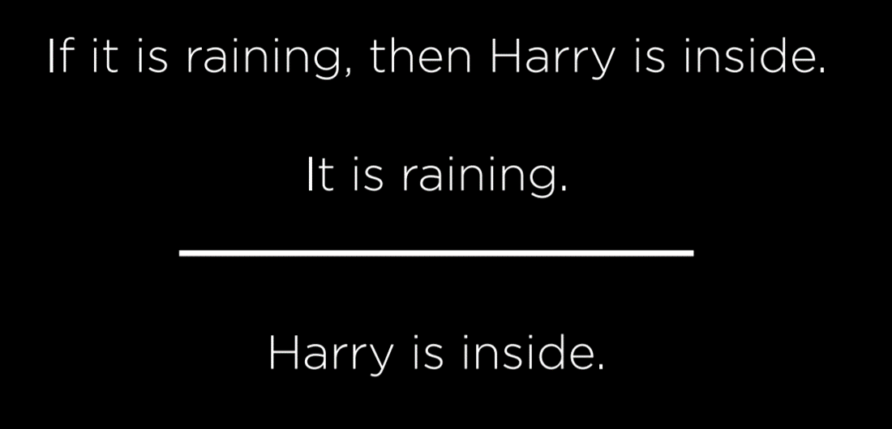
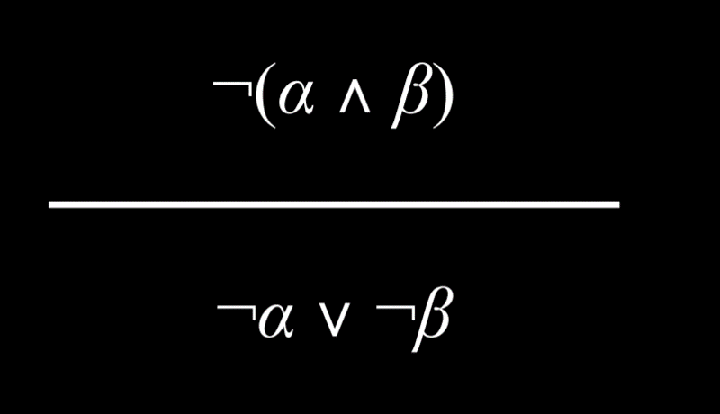
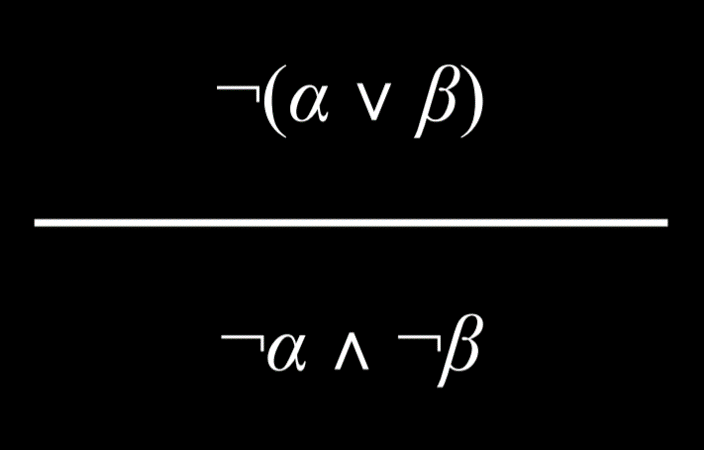
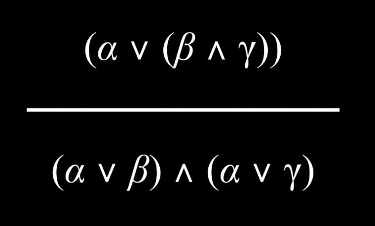
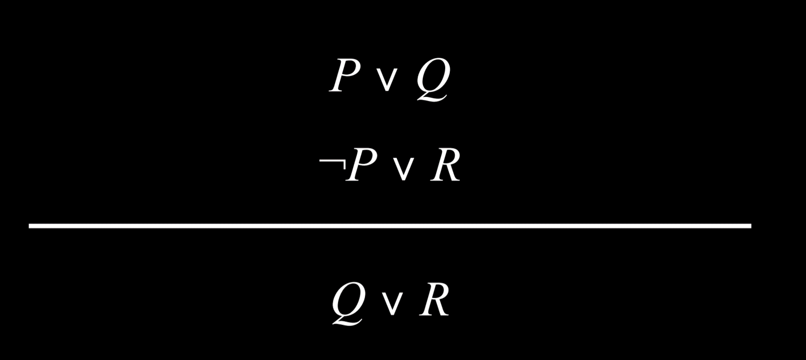

# LECTURE 2: KNOWLEDGE

- Intelligence is based on knowledge.
- Using information that we know about our environment and facts about the world, we humans are able to draw conclusions.
- In this lecture we focus on the takin of ideas/information and feeding them to algorithms that can reason and act upon the konwledge.

- __Knowledge based agents__ : agents that reason by operationg on internal representations of knowledge.
- __Eg__
  - If it didn't rain, Harry visited Hagrid today.
  - Harry visited Hagrid or Dumbledore today, but not both.
  - Harry visited Dumbledore today.
- From the above information we can infer:
  - Harry didn't visit Hagrid today.
  - It rained.

- So were focusing on how to enable our AI algorithms to be able to get to the same conclusions and get the same information from its _knowledge base_

- __sentence__: this is an assertion about the world in a knowledge representation language.

## PROPOSITIONAL LOGIC

- This is based on propositions being used to represent facts about the world.
- __Propositional symbols__ :
  - symbols (_often letters_) userd to represent some fact about the world.
- To represent a fact about the world, we use a _proposition_. for example if we wanted to represent the fact that it is raining, we would use the proposition R.
- But we have to find a way to connect propositions so that we may be able to reason.

### __Logical connectives__

- these are symbols used to connect propositions together to enable more complex reasoning.
- __Not (¬)__ :
      | __P__ | __¬P__ |
      | ---  | --- |
      |false | true |
      |true | false |
  - Basically this connector inverts the statement given.
- __And (∧)__ :
      | __P__ | __Q__ | __P ∧ Q__ |
      | ---  | --- | --- |
      |false | false | false |
      |false | true | false |
      |true | false | false |
      |true | true | true |
  - And combines two sentences in propositional logic.
  - It requires that both be true for the statement to be true and is false otherwise.
- __Or (∨)__ :
      | __P__ | __Q__ | __P ∨ Q__ |
      | ---  | --- | --- |
      |false | false | false |
      |false | true | true |
      |true | false | true |
      |true | true | true |
  - Or evaluates to true when either one of its arguments is true.
  - it only needs one argument to be true to evaluate to true.
  - There are two types of or:
    - _inclusive or_ : returns true if either of the arguments or both are true.
    - _exclusive or_ : returns true if only one of the arguments is true, if both are true it returns false.
- __Implication (→)__
      | __P__ | __Q__ | __P → Q__ |
      | ---  | --- | --- |
      |false | false | true |
      |false | true | true |
      |true | false | false |
      |true | true | true |
  - This basically means if p is true then q is true.
  - The state of the first determines the other.eg if it is raining then i will be indoors.
  - When p is false then the implication is irrelevant and thus makes no claim.
  - But as long as p is in one state, q has to be in a similar state
- __Biconditional (↔)__
      | __P__ | __Q__ | __P ↔ Q__ |
      | ---  | --- | --- |
      |false | false | true |
      |false | true | false |
      |true | false | false |
      |true | true | true |
  - This can be read as an if and only if.
  - The biconditional is only true when p and q are the same.

- The next thing we need is a way of knowing what is actually true about the world.

- __Model__ :
  - this assigns a truth value to every propositional symbol.
  - It creates a possible werld.
  - eg :
    - _P_: it is raining.
    - _Q_: it is a tuesday
    - the model assigns: {_P_= true, _Q_=false}

  - The model creates all possible combinations.
  - If there are n symbols the model creates __$2^n$__ combinations.
  - A model is similar to deph first search.

- __knowledge base__:
  - a set of sentences that our algorithm knows to be _true_.
  - Our agent has access to these sentences.
  - These are the things that our ai knows about the world.
  - This information is either given to the ai by the user or it is learned by the ai.
- __Entailment (⊨)__:
  - _α ⊨ β_: in the expression alpha entails beta.
  - This means that in every possible world where sentence alpha is true, beta is also true.
  - When i know alpha is true it is reasonable to conclude that beta is also true.
  - Entailment is basically making reasonable deductions from the information available to us.
  - This is what we want to encode into out algorithms, the ability to make reasonable deductions.

- __inference__:
  - the process of deriving new sentences from old ones.
  - This is the output of our algorithms.
  
### inference algorithms

- _P_: It is a Tuesday.
- _Q_: It is raining.
- _R_: Harry will go for a run.
- __KB__:
      - _(P ∧ ¬Q) → R_ ( _P_ and _not Q_ implies _R_)
      - _P_ (P is true)
      - _¬Q_ (Q is false)
- __Query__: _R_ (We want to know whether R is true or false; Does _KB ⊨ R?_).
- To put it into words if it is a tuesday and it is not raining, harry will go for a run.
- Using the above information we can reason out the query.
- __Inference__: from the knowledge we can infer that the query _R_ is true.

- [^]:these inference algorithms a processes we can use to synthesise the information provided to answer the quesion about entailment.

- Given a knowledge base and a query does the knowlege base entail the query.(__KB⊨α ?__).
- There are different algorithms that can do this king of entailment and inference.
  
### Model checking

- A model is and assignment of all possible combinations to a truth value.

```python
    - To determine if KB ⊨ α:
        - Enumerate all possible models.
        - If in every model where __KB__ is true, __α__ is also true, then __KB__ entails __α__.
```

- Whenever our knowledge is true then alpha should be true otherwise there is no entailment.
- An example is like the following.
__P__: It is a Tuesday   __Q__: It is raining    __R__: Harry will go for a run.
___KB: (P ∧ ¬Q) → R     P    ¬Q___
__Query: R__
| __P__ | __Q__ | __R__ | __KB__ |
| ----- | ----- | ----- | ------ |
| false | false | false | false |
| false | false | true  | false |
| false | true  | false | false |
| false | true  | true  | false |
| true  | false | false | false |
| _true_  | _false_ | _true_  | __true__ |
| true  | true  | false | false|
| true  | true  | true  | false|

- We want to know if its gurranteed that harry will go for a run.
- We have to enumerate all possible models. In the above example we have three( p , q , and r )propositional symbols and thus _$2^3$_(8) possile models.
- In each we ask if the knowledge base is true.
- In every model where p is false the knowledge base is also false.
- Likewise in any model where q is true the knowledge base is false.
- Also any model where p is true q is false and r is false , the knowledge base is false or entails nothing.
- Therefore the only model that is true is the one that matches the info in the knowledge base.

```python
    from logic import *

    # Create new classes, each having a name, or a symbol, representing each proposition.
    rain = Symbol("rain")  # It is raining.
    hagrid = Symbol("hagrid")  # Harry visited Hagrid
    dumbledore = Symbol("dumbledore")  # Harry visited Dumbledore

    # Save sentences into the KB
    knowledge = And(  # Starting from the "And" logical connective, becasue each proposition represents knowledge that we know to be true.

        Implication(Not(rain), hagrid),  # ¬(It is raining) → (Harry visited Hagrid)

        Or(hagrid, dumbledore),  # (Harry visited Hagrid) ∨ (Harry visited Dumbledore).

        Not(And(hagrid, dumbledore)),  # ¬(Harry visited Hagrid ∧ Harry visited Dumbledore) i.e. Harry did not visit both Hagrid and Dumbledore.

        dumbledore  # Harry visited Dumbledore. Note that while previous propositions contained multiple symbols with connectors, this is a proposition consisting of one symbol. This means that we take as a fact that, in this KB, Harry visited Dumbledore.
        )
```

- To run the model checking algorithm we need the following info.
  - _Knowledge base_: used to draw inferences
  - _Query_: proposition were trying to see if its entailed by the knowledge base
  - _Symbols_ : a list of all propositions used(rain, hagrid, dumbledore)
  - _Model_: assignment of truth and false values to symbols.
- The following is the model checking algorithm that looks at the info in the knowledge base and tries to find a model where the knowledge base is true and thus entails the query.

```python
    def check_all(knowledge, query, symbols, model):

        # If model has an assignment for each symbol
        # (The logic below might be a little confusing: we start with a list of symbols. The function is recursive, and every time it calls itself it pops one symbol from the symbols list and generates models from it. Thus, when the symbols list is empty, we know that we finished generating models with every possible truth assignment of symbols.)
        if not symbols:#if we finish assigning all symbols

            # If knowledge base is true in model, then query must also be true
            if knowledge.evaluate(model):
                return query.evaluate(model)
            return True
        else:

            # Choose one of the remaining unused symbols
            remaining = symbols.copy()
            p = remaining.pop()

            # Create a model where the symbol is true
            model_true = model.copy()
            model_true[p] = True

            # Create a model where the symbol is false
            model_false = model.copy()
            model_false[p] = False

            # Ensure entailment holds in both models
            return(check_all(knowledge, query, remaining, model_true) and check_all(knowledge, query, remaining, model_false))
```

- The above is the same as a breadth first search where we pop the symbols in queue.(FIFO).
  
#### Knowledge Engineering

- this is the process of taking a problem and synthesizing it to its bare bones so that you can figure out what propositional symbols can be used to represent it and therfore solve it algorithmically.
- Taking a problem and distilling it down to computer representible knowledge.
- in this way we can take any real world problem and use computers to solve it.
- the following is an example of knowledge engineering in practice.
  - We will do this with the game of clue.

##### clue

- In the game, there are a number of different people, rooms and weapons.
- Whate were trying to do is find out the killer's name, room where killing took place  and their weapon of choice.
| __PEOPLE__ | __ROOMS__ | __WEAPONS__ |
| ---------- | --------- | ----------- |
| Miss Scarlet | Ballroom | Wrench |
| Professor Plum | Kitchen | Revolver |
| Mr Mustard | Library | Knife |

- At the beginning of the game, all these cards are shuffled together and three of them, are put into an envelope.(one of each category)
- The point of the game is to logically figure out which cards are in the envelope.
- __Propositional symbols__: all the items in the table above.
- THe propositional symbol returns true if it is the one in the envelope and false otherwise.
- To encode the information we have to reason through it.
- We know that one person is the murderer
- We also know that the crime was committed in one of the rooms.
- And we also know that one of the weapons was used.
- So we can encode the information as follows:

__KB__:

```python
(mustard v plum v scarlet)
(ballroom v kitchen v library)
(knife v wrench v revolver)
  ¬plum 
  ¬mustard v ¬library v ¬revolver
```

- The knowledge base above is a propositional logic representation of the information we know
- To represent it in code we can do the following.

```python
# Add the clues to the KB
knowledge = And(

    # Start with the game conditions: one item in each of the three categories has to be true.
    Or(mustard, plum, scarlet),
    Or(ballroom, kitchen, library),
    Or(knife, revolver, wrench),

    # Add the information from the three initial cards we saw
    Not(mustard),
    Not(kitchen),
    Not(revolver),

    # Add the guess someone made that it is Scarlet, who used a wrench in the library
    Or(Not(scarlet), Not(library), Not(wrench)),

    # Add the cards that we were exposed to
    Not(plum),
    Not(ballroom)
)
```

##### logic puzzles

- We cand use knowledge engineering and propositional logic to solve logic puzzles like the one below.
- Gilderoy, Minerva, Panoma and Horace each belong to a different one of the four houses: Gryffindor, Hufflepuff, Ravenclaw and Slytherin house.
- Gilederoy belongs to Gryffindor or Ravenclaw.
- Pamona does not belong to Slytherin
- Minerva belongs to Gryffindor.

- _in this puzzle were trying to find out which person belongs to which house._
- __propositional symbols__:
  for this problem we need 16 propositional symbols, one for each person and house.

- We can also make logical deductions like no one person belongs to two or more houses at the same time.(one person cant belong to two houses)
- All people are in different houses.

- [^]:however model checking isn't the most efficient method to use because it enumerates all the possibilities.
- As the number of variables increases, model checking becomes less and less efficient.
- What would be a better way to find solutions to problems without having to enumerate all possibilities.

## INFERENCE RULES

- These are rules that we can apply to turn knowledge we allready know into new forms of knowledge.
  
  _premise_
  ____________->_logic_
  _conclusion_
- Basically we have a horisontal line. Anything above the line is the premise/ knowlegde base/facts we know to be true.
- Anything below the line is the conclusion we can arrive at after applying the logic from the inference rules.

- 

- From the above image we can conclude that harry is inside.
- This is how _modus ponens_ works.

### MODUS PONENS

- If we know that _alpha implies beta_, and we also know that _alpha is true_, we can conclude that _beta is also true._
- 
- Notice that here instead of enumerating all possible worlds we just work from the knowledge at hand and make conclusions from it.
- Modus ponens is the application of implication.

### AND ELIMINATION

  Harry is friends with Ron and Hermione
        _________________________
      Harry is friends with hermione.

- 
- If we have a situation where _alpha and beta_ are both true , then each of them is true. _alpa is true_ and _beta is true_

### DOUBLE NEGATION ELIMINATION

  It is not true that Harry did not pass the test.
        _____________________
            Harry passed the test


- If we have two negatives inside our premise, then they cancel each other out.
- If the premise is _not not alpha_ then we can conclude _alpha_

### IMPLICATION ELIMINATION

  If it is raining, then Harry is inside.
    ________________________
    It is not raining or Harry is inside.

- If i know that is is raining then Harry is inside.
- If Harry is not inside then it is not raining.


- This translates __if then__ statements into __or__ statements.
- If _alpha implies beta_ then i can draw the conclusion of either _not alpha_ __or__ _beta_.
- Its either alpha is true and therefore beta is also true or alpha is not true and thus beta is also not true.
- Consider the following table.
| __P__ | __Q__ | __P → Q__ | __¬P ∨ Q__ |
| ----- | ----- | --------- | ---------- |
|__false__| false | true | true |
|__false__| true | true | true |
|__true__| false | false | false |
|__true__| true | true | true |

- Since P → Q and ¬P ∨ Q have the same truth-value assignment, we know them to be equivalent logically. Another way to think about this is that an implication is true if either of two possible conditions is met: first, if the antecedent is false, the implication is trivially true (as discussed earlier, in the section on implication). This is represented by the negated antecedent P in ¬P ∨ Q, meaning that the proposition is always true if P is false. Second, the implication is true when the antecedent is true only when the consequent is true as well. That is, if P and Q are both true, then ¬P ∨ Q is true. However, if P is true and Q is not, then ¬P ∨ Q is false.

### BICONDITIONAL ELIMINATION

  It is raining if and only if Harry is inside
    __________________________________
        If it is raining, then Harry is inside,
        and if Harry is inside, then it is raining.


- We can take _alpha if and only if beta_ and conclude that _alpha implies beta_ and _beta  implies alpha_.

----
Many of these inference rules take logic that uses certain symbols and convert them into other symbols.

----

### De Morgan's Law

  It is not true that both
Harry and Ron passed the test.
    ___________________
  Harry did not pass the test
or Ron did not passs the test.

- We can turn an and into an or by mooving the nots around.



- If it is _not true_ that __alpha and beta__ then either _not alpha_ or _not beta_
- Here we move the negation inward and it flips the and into an or.

- The reverse is also true.
  
----
  It is not true that
  Harry or Ron passed the test.
      ______________________
   Harry did not pass the test
  and Ron did not pass the test.

- Neither of them passed the test.

----


- The above is the inverse of demorgans law.
- If it is _not alpha or beta_ then _not alpha and not beta_.

### DISTRIBUTIVE LAW

- This is the equal distribution of all logical operands in an expression.


- If _alpha and (beta or gamma)_  then we can distribute the and as follows: _alpha and beta_  or _alpha and gamma_.



- If _alpha or (beta and gamma)_ then we can distibute the or as follows _alpha or beta_ and _alpha or gamma_.

### UNIT RESOLUTION RULE

- This is based on an inference rule as follows.

    (Ron is in the Great Hall) or (Hermione is in the library)
            Ron is not in the great Hall
            ____________________________
            Hermione is in the library.

- The first two statements are complimentary literals meaning they are  opposites.
- If one is true the other is false.


- If _p or q_ are true and we know _not p_ the only possibility is q to be true.
- P and not p cancel each other out.
- This inference rule can be very powerful in finding solutions to problems very quickly.
- Resolution relies on __Complementary Literals__, two of the same atomic propositions where one is negated and the other is not, such as P and ¬P.
- When two literals compliment each other they _resolve_ each other to produce a new clause void of the complimentary literals.
- This idea can be further generalised.

    (Ron is in the Great Hall) or (Hermione is in the library)
    (Ron is not in the Great Hall) or (Harry is sleeping)
      __________________________________________________
      (Hermione is in the library) or (Harry is sleeping)

- Because the two arguments of Ron being in the great hall compliment each other, they resolve one another and we end up with one of two scenarios.
      - Either ron is in the great hall and harry is sleeping
      - Or ron is not in the great hall  and hermione is in the library
      - We can therefore conclude that Harry is either sleeping or Hermione is in the library depending on Ron's locale.



- If we know that _p or q_ is true, and we also know that either _not p or r_ is true, we can resolve the two and conclude that either _q or r_ is true.

----
----
After seeing all these inference rules, the question now becomes  how we can use the above inference rules to actually try and draw some conclusions and reason out of problems.

----

-Given some initial knowledge base we would like to prove that a query is true.

## KNOWLEDGE AND SEARCH PROBLEMS

- We can take knowledge problems and frame them as search problems as follows.
      - Initial state : _original state of knowledge base_
      - Actions : _inference rules_
      - Transition model : _new knowledge base after inference_
      - Goal test : _checking if query is true(is in kb)_
      - Path cost function : _number of steps in the proof_

___Clause___: This is a _disjunction_ of _literals_.(P v Q v R)
__Disjunction__: a bunch of things connected with _or_.
__Conjunction__: a bunch of things connected with _and_.
__Literal__: a propositional symbol or its opposite (_p or ¬P_)

- Resolution and inference rules gives us the ability to turn any logic or logical sencence into _conjunctive normal form_

### CONJUNCTIVE NORMAL FORM

___Conjunctive normal form___(__CNF__): a logical sencence that is a conjunction of clauses.

- That is individual or clauses connected with and.
eg:
  _(A v B v C) ^ (D v ¬E) ^ (F v G)_

- CNF is a standard form that we can translate any logical sentence into to make it easy to work with.( By applying some inference rules and transformations)

#### Process of taking a logical formula and converting it into CNF (Inference by Resolution)

- Take all symbols that are not of CNF(biconditionals, implications etc..) and translate them into CNF.
  1. Eliminate biconditionals
       - Turn __(α ↔ β)__ into _(α → β) ∧ (β → α)_.
  2. Eliminate implications
       - Turn __(α → β)__ into _¬α ∨ β_.
  3. Move negation inwards until only literals are being negated (and not clauses), using De Morgan’s Laws.
       - Turn __¬(α ∧ β)__ into _¬α ∨ ¬β_
  4. Use distributive law to distribute the or's wherever possible.

__Example__:
Here’s an example of converting (P ∨ Q) → R to Conjunctive Normal Form:
  __(P ∨ Q) → R__
  __¬(P ∨ Q) ∨ R__ :_Eliminate implication_
  __(¬P ∧ ¬Q) ∨ R__ :_De Morgan’s Law_
  __(¬P ∨ R) ∧ (¬Q ∨ R)__ :_Distributive Law_. This is now in CNF.

- Once in the CNF we can input these clauses into the resolution inference rule where we can resolve complimentary literals to come up with new clauses and so on until we get to the solution.
- This procss is called ___Inference by resolution___.
- Occasionally, through the process of inference by resolution, we might end up in cases where a clause contains the same literal twice.
- In these cases, a process called __factoring__ is used, where the duplicate literal is removed.
- For example:
      - (P ∨ Q ∨ S) ∧ (¬P ∨ R ∨ S) allow us to infer by resolution that (Q ∨ S ∨ R ∨ S).
      - The duplicate S can be removed to give us (Q ∨ R ∨ S).

  __(P ∨ Q ∨ S) ∧ (¬P ∨ R ∨ S)__
      ________________________
      (Q v S v R v S ) -> _(Q v S v R)_

- Resolving a literal and its negation, i.e. ¬P and P, gives the empty clause ().
- __The empty clause is always false__, and this makes sense because it is impossible that both P and ¬P are true.
- This fact is used by the resolution algorithm.

    P ∧ ¬P
      ______
    ()

- If there is ever a resolution that causes an empty clause.

### INFERENCE BY RESOLUTION

To determine if __KB ⊨ α__:
  Check: is __(KB ∧ ¬α)__ a _contradiction?_
    If so, then __KB ⊨ α.__
  Otherwise, no entailment.

- Proof by contradiction is a tool used often in computer science.
- If i want to prove that sth is true, i first assume that it is false and show that it leads to a contradiction therefore it must be true.
- If our knowledge base is true, and it contradicts ¬α, it means that ¬α is false, and, therefore, α must be true.
- More technically, the algorithm would perform the following actions:

___RESOLUTION ALGORITHM___
  
```PY
To determine if KB ⊨ α:
  Convert (KB ∧ ¬α) to Conjunctive Normal Form.
  Keep checking to see if we can use resolution to produce a new clause.
    If we ever produce the empty clause (equivalent to False), congratulations! We have arrived at a contradiction, thus proving that KB ⊨ α.
  However, if contradiction is not achieved and no more clauses can be inferred, there is no entailment.
```

Here is an example that illustrates how this algorithm might work:

```py
Does (A ∨ B) ∧ (¬B ∨ C) ∧ (¬C) entail A?
First, to prove by contradiction, we assume that A is false. Thus, we arrive at:
  (A ∨ B) ∧ (¬B ∨ C) ∧ (¬C) ∧ (¬A).
Now, we can start generating new information. Since we know that C is false (¬C), the only way (¬B ∨ C) can be true is if B is false, too. Thus, we can add (¬B) to our KB.
Next, since we know (¬B), the only way (A ∨ B) can be true is if A is true. Thus, we can add (A) to our KB.
Now our KB has two complementary literals, (A) and (¬A). We resolve them, arriving at the empty set, (). The empty set is false by definition, so we have arrived at a contradiction.

We can therefore conclude that KB |= A.
```

----
----
All of the above is based on only one type of logic( propositioal logic ) where individual symbols are connected with propositions.

In propositional logic there are limitations.
SO we have other types of logic.

## FIRST ORDER LOGIC

- To recuce redundancy we use firs order logic where we introduce types of symbols:
- If we go back to the problem on houses and people we can come solve it as  follows:

| __constant symbol__(represent objects) |
| ------- |
| Minerva |
| Pamona |
| Horace |
| Gilderoy |
| Gryffindor |
| Hufflepuff |
| Ravenclaw |
| Slytherin |

 |__Predicate symbol__(functions that evaluate to true or false) |
 | --------|
 | Person |
 |House |
 | Belongs to(relates people to houses) |

- A sentence in first order logic would look as follows:
  - Person (Minerva) -> minerva is a person
  - House (Gryffindor) -> gryffindor is a house.
  - ¬House (Minerva) -> minerva is not a house.
  - Belongs to (Minerva, Gryffindor) -> minerva belongs to gryffindor.

- Unlike propositional logic where enumerate all symbols here, we enumerate symbols as needed and  take advantage of functions to do the hard work.
- We minimise the number of symbols needed.
- We also have available additional features to represent even more complex ideas.

### Quantifiers

- There are two main types of quantifiers:

#### 1. Universal Quantification

- This is the expression that summ is going to be __true for all values__ of a variable.
- Universal quantification uses the symbol __∀__ to express _“for all.”_.
- So, for example, the sentence:
 __∀x. BelongsTo(x, Gryffindor) → ¬BelongsTo(x, Hufflepuff)__ expresses the idea that it is true for every symbol that if this symbol belongs to Gryffindor, it does not belong to Hufflepuff.
- Anyone in gryffindor is not in hufflepuff.
  
#### 2. Existential Quantification

- This is used to represent the idea that sumn is true for __at least one value__ of a variable.
- It is expressed using the symbol __∃__.
- For example, the sentence __∃x.House(x) ∧ BelongsTo(Minerva, x)__ means that there is at least one symbol that is both a house and that Minerva belongs to it.
- In other words, this expresses the idea that Minerva belongs to a house.

----

- Existential and universal quantification can be used in the same sentence.
- For example, the sentence:
  - ___∀x. Person(x) → (∃y. House(y) ∧ BelongsTo(x, y))___ :expresses the idea that if x is a person(for all people), then there is at least one house, y, to which this person belongs.
  - In other words, this sentence means that every person belongs to a house.

- Using this we can represent more complex ideas to our AI algorithms/agents.
- And be able to reason using that knowledge.
