# LECTURE 2: UNCERTAINTY

- In reality its very rare that machines or AI agents are going to no things for sure therefore they have to be able to deal with uncertainty.
- We want our computer to still be able to make inferences with knowledge that is either incomplete or unverified.
- We want to use the info available with probability to make predictions.
- Here we can distill the decisions to possible events that might occur and their probability of occurring.

## Probability theory

- This will give us the mathematical tools we can use to represent probability in our computers and algorithms.
- Probability boils down to the idea that there are possible worlds.Represented by omega(ω).
- THe idea of possible worlds is the possible end states that can be achieved by doing an action. Each possible world has a probability of occurring.
- __P(ω)__: represents the probability of a particular world occurring/being true.

### Axioms of probability

- __0 < P(ω) < 1__
  - Every prbability value ranges between 0 and 1 inclusive.
  - _0_ is an impossible event.
  - _1_ is a certain event.(unavoidable/guranteed)
  - The higher the probability value the more likeyly the event is to take place and vice versa.

- __P(ω) + P(ω') = 1__
  - 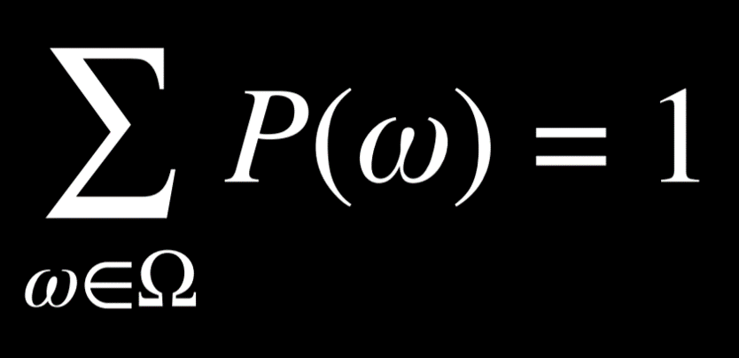
  - If i add up all possible worlds then the total probability should be 1.
  - For example:
    - When we roll a 6sided dice, the probability of getting a 1 is 1/6 because there are 6 possible worlds.
    - If we are rolling 2dice we now care about the sum. We are now faced with 36 possible worlds as shown below.
      - 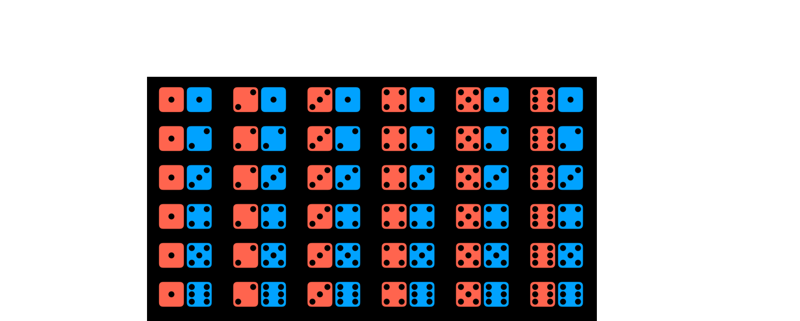
      - Each of the above possible worlds are equally likely but the sums are not equally likely.
        - 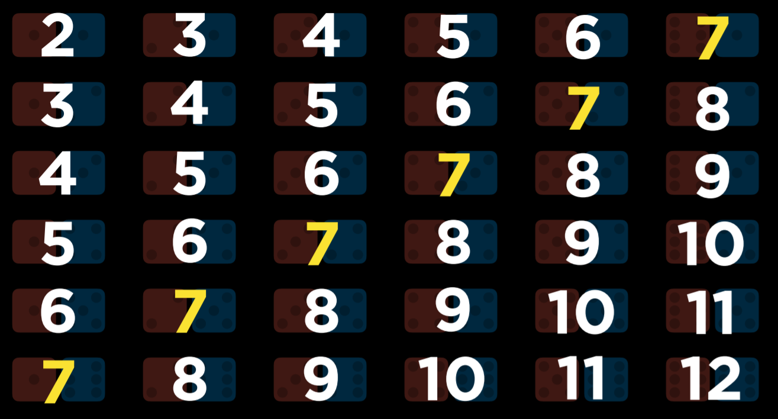
      - In summation, every number doesnt come up equally likely.
      - There are 6 possible worlds where the sum is 7 but only one possible world where the sum is 12
      - therefore we have a higher probability of getting a seven rather than a 12
      - _P(sum 12) = 1/36_
      - _P(sum 7) = 6/36 = 1/6_

### Unconditional probability

- This is the degree of belief in a proposition in the absence of any other evidence.
- Here we have no additional info or knowledge base to work off of.

### Conditional probability

- This is the degree of belief in a proposition given some evidence that has been revealed or knowledge base.
- Here we have some initial knowlede on how the world works and can work off of a knowledge base.
- __P( _a_ | _b_ )__
  - What is the probability of _a given b_
  - This is the representation of conditional probability.
  - __a__: query: what we want the probability of
  - __b__: evidence: the info we allready know for certain about the world
  - Were trying to find what the probability is of a evaluating to true given b is true.
  - For example:
    - The probability of rain today given it rained yesterday.
      - P(rain today | rain yesterday)
  - From the evidence we have what is the probability that a certain situation occurs.
- To calculate conditional probability  of a given b we use the following formula.
  - 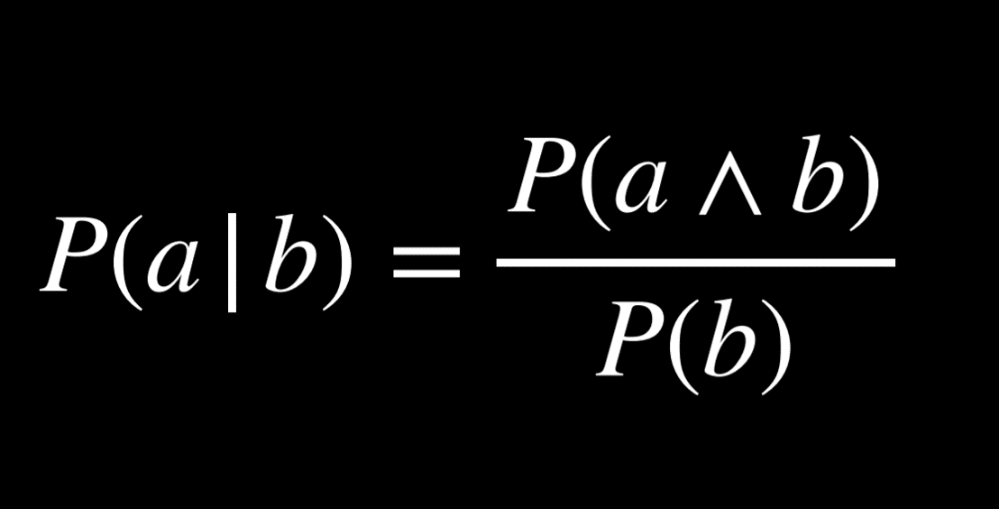
    - Read as: the probability of a given b is equal to the probability that _a and b_ is true divided by the probability that _b_ is true.
    - I only care about the worlds where b is true. In these worlds i want to konw where both are true.
    - Dividing by b restricts the possible worlds to the ones where b is true.
    - The above equation can also be represented as follows:
      - 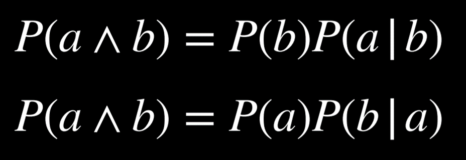

    - This is the same as the previous equation but with the addition of the knowledge base.
    - For example:
      - If we go back to the problem of rolling two dice, the probability of rolling a 12 was 1/36.
      - Lets say i know the red dice rolled a 6.
      - Whats the probability that the two dice sum to 12.
      - First we ask what the possibility is that the red dice is a six.
      - For this we restrict our search to worlds where the red dice is a six.
        - 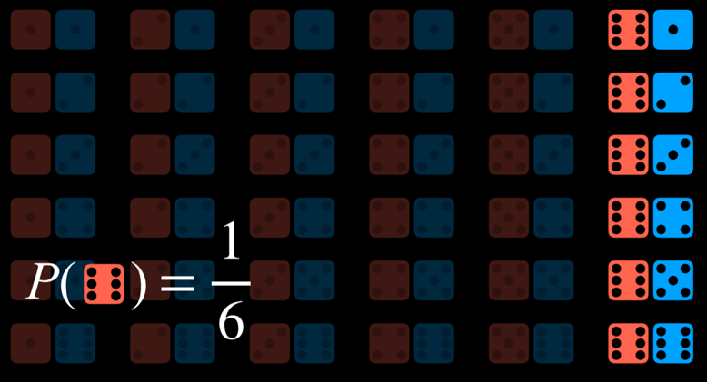
      - We now ask in how many worlds we get the sum 12 in the restricted worlds dividing by the probability that the first dice yielded a six.
        - 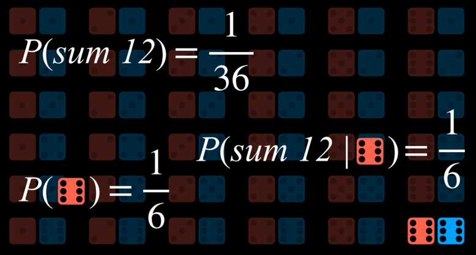

#### Random Variables

- Sometimes in prbability we dont only care about a boolean event(it happened or it didnt), we sometimes deal with a range of values with differing probabilities of happening.
- _Random Variable_: a variable in probability theory with a domain of possible values it can take on.
- For example:
  - for a dice we can define a variable _roll_ that can take on the values _{1,2,3,4,5,6}_
    - For this we might like to know the probability of each (which is equal)
  - To represent the status of a flight we can define a variable _Flight_ that takes on the values _{on time,delayed,canceled}_
    - Each of the values has a different probability depending on the prevailing conditions.
- The above is what we call a __probability distribution__:
  - The probability my random variable takes on each of the possible values in its domain.
  - For example:
    - THe probability distr for a flight might look as follows:
      - _P(Flight = on time) = 0.6_ 60%
      - _P(Flight = delayed) = 0.3_ 30%
      - _P(Flight = ncancelled) = 0.1_ 10%
      - If you sum up all the above they add up to 100% or 1.
      - Realise the range is from 0-1 and the sum is 1.
    - The above probability dist is very verbose and can be more succinctly be represented as a vector:
    - __Vector__: a list/sequence of values in order.
      - __P__ __(Flight) = <0.6,0.3,0.1>__
      - The values have a set order according to what they represent to make it interpretable.

#### Independence

- The knowledge that one event occuring does not affect the prbability of an other event occuring.
- The knowledge of one event doesnt influence the probability of an other event.
- Example:
  - When rolling the dice, the value of one dice doesn't affect the value of the other. They are both independent.
- This is oppoesed to dependent events where maintenance on a runway may mean a delay or flight cancellation.
- Independence can be defined mathematically: events a and b are independent if and only if the probability of a and b is equal to the probability of a times the probability of b: P(a ∧ b) = P(a)P(b).

---

- Explanation:
  - __P(a ∧ b) = P(a)P(b|a)__:
    - the probability of _a_ and _b_ is the prbability of _a_ happening multiplied by the probability of _b_ happening given _a_ happened.
  - But because these events are independent, konwing a doesnt change anything about b  the probability of b given a _(P(b|a))_ is simply the probability of b if theyre independent.
  - THerefore we get the formula:
  - __P(a ∧ b) = P(a)P(b)__
  - For example :
    - With the dice: _P(12) = P(1/6) P(1/6)_ = 1/36

---

#### Bayes Rule

- Bayes rule is a mathematical formula that allows us to update the probability of a hypothesis given new evidence.
- To derive bayes rule we go back to the following equations:
   __P(a^b) = P(b)P(a|b)__
   __p(a^b) = P(a)P(b|a)__
 Because both equations are _p(a^b)_ then both are equal and from them we can derive:
   __P(a)P(b|a) = P(b)P(a|b)__
 From here we can do a lil division:
    __P(b|a) = P(a|b)P(b)__
             _______________
                 __P(a)__

- This is the baye's rule.
- 
- It states that the probability of _b given a_ is equal to the probability of _b_ multiplied by the probability of _a given b_ divided by the probability of _a._
- This formula becomes very important in probability because we can infer one probability from another that i know about.
- For example:
  - _I would like to know the probability of rain in the afternoon given clouds in the morning._
    - _Knowledge base_
      - 80% of rainy afternoons start with cloudy mornings
      - 40% of days have cloudy mornings
      - 10% of days have rainy afternoons.
    - _query_:
      - __P(rain|clouds)__
    - _Calculation:_
      - __p(rain|clouds) = P(clouds|rain)*P(rain)/P(clouds)__
      - _P(rain|clouds) = (0.8)*(0.1)/ (0.4)_ = __0.2__
      - __p(rain|clouds ) = 0.2__
      - It is 20% probable  that a cloudy morning will cause it to rain in the afternoon.
  - Knowing _P(cloudy morning | rainy afternoon)_ we can calculate _P(rainy afternoon| cloudy morning)_
- More generally : Knowig the probability of a visible effect given an unknown cause __P(_visible effect_|_unknown cause_)__ we can calculate the probability of an unknown cause given the visible effect __P(_unknown cause_|_visible effect_)__
- This can be used when one piece of data is more easily available than the other.

---

### Joint probability

- This is the probability of multiple events occuring simultaneously.
- For example my _probability distr_ for clouds in the morning might look as follows.

    |__C = cloud__ | __C = ¬cloud__ |
    |----------------|----------------|
    | 0.4 | 0.6 |

-The _probability distr_ for rain in the afternoon might be as follows

  |__R = rain__   | __R = ¬rain__   |
  |----------------|----------------|
  | 0.1 | 0.9 |

- From the above two pieces of info i dont know how they relate, but i can if i have access to their __joint probability distribution__

    | |__R = rain__   | __R = ¬rain__   |
    |-------|---------|----------------|
    |__C = cloud__ | 0.08 | 0.32 |
    |__C = ¬cloud__ | 0.02 | 0.58 |

- From the above i can now tell the probability distributions for each combination of weather variables
- From the above distr i can now make new inferences and also find out joint/conditional probability
- eg: _P(c|rain)_:
  - What is the probability of clouds given it is raining.
  - if we are interested in the probability distribution of clouds in the morning given rain in the afternoon.
  - _P(C | rain) = P(C, rain)/P(rain)_ (a side note: in probability, commas and ∧ are used interchangeably. Thus, P(C, rain) = P(C ∧ rain)).
  - In words, we divide the joint probability of rain and clouds by the probability of rain.
  - _P(c | rain) = P(c^rain)/P(rain)_
  - In the last equation, it is possible to view P(rain) as some constant by which P(C, rain) is multiplied.
  - Thus, we can rewrite _P(C, rain)/P(rain)_ = __αP(C, rain)__, or __α<0.08,0.02>__.
  - __α<0.08,0.02>__ the factor is 10 so that all values in our probability distr sum up to 1
  - __<0.8,0.2>__
  - The alpha is a normalization constant

- _The key idea here is that the __conditional distribution__ of c given rain __P(C|rain)__ is proportional to (α)(some factor multiplied by) the joint probability of c and rain_ __αP(C, rain)__

### Probability rules

___1. Negation: P(¬a) = 1 - P(a)___

- Here we want to find out the probability that event _a_ does not occur.
- That is 1- the probability of a because the sum of all possible worlds is 1,and _a_ and _¬a_ are the two possible worlds.

___2. Inclusion-Exclusion: P(a ∨ b) = P(a) + P(b) - P(a ∧ b)____

- This is the likelyhood of a or b being true in any possible worlds(say a dice rolling a 6)
- This can be calculated as all the worlds where a is true _plus_ all worlds where b is true.
- The above however suffers form overcounting whre some worlds are counted twice(where both a and b are true)
- To avoid this overlap, we subtract once whre both a and b are true.
- Therefore we endu up with the probability of a _plus_ the probability of b _minus_ the probability of _a and b_

___3. Marginalization: P(a) = P(a, b) + P(a, ¬b)___

- Here we answer the question, how do i figure out the probability of a using some other variable i have access to like b.
- This is like using info in the knowledge base to make inferences.
- Solution:
  - I know that b(some event) has two possible states, either b happens or b doesn't happen.
  - To calculate the probability of a i have only two cases/possible worlds:
    - Either _a and b_ happens or _a happens and b doesnt_
      - for example its cloudy and rains or its cloudy and doesnt rain.
    - The above two are disjoint meaning they can't happen together.
  - I can therefore figure out the probability of a by adding up the two disjoint cases and eliminating b.

- Sometimes instead of having events that either happen or don't we may have broader probability distributions with multiple possible values.
- So here we dont sum up b or not b but all possible values that the other random variable could take on.
- 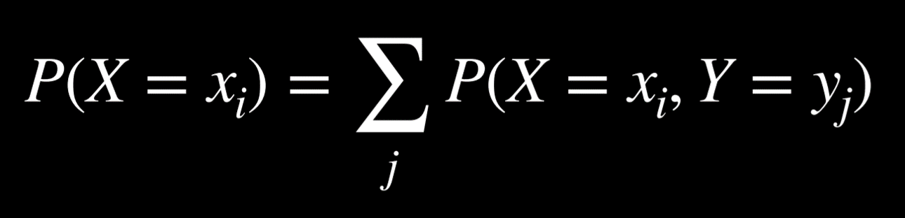
- Explanation:
  - I have two random variables X and Y
  - The probability that X is equal to some value x abides(some value of x)($X = x_i$)
  - _We sum up over j(all possible values y can take on)_
  - we look at the probability that $X=X_i  and  Y = Y_j$
- For example:

    | |__R = rain__   | __R = ¬rain__   |
    |-------|---------|----------------|
    |__C = cloud__ | 0.08 | 0.32 |
    |__C = ¬cloud__ | 0.02 | 0.58 |

  - __P(C = cloud)__
    - = _P(C=cloud, R= rain) + P(C=cloud, R = ¬rain)_
    - = 0.08 + 0.32
    - = __0.40__

___4. Conditioning: P(a) = P(a | b)P(b) + P(a | ¬b)P(¬b)___

- This rule is similar to the marginalization rule.
- I have two events(a and b) but instead of having access to their joint probabilities i have access to their conditional probabilities(how they relate)
  - To know the probability that a happens:
    - Event b has only two states, either it happens or it doesn't happen.
    - The probability of a is equal to _the probability of a given b  is true multiplied by the probability of b occuring_ plus _the probability of a given b is false(not b) multiplied by the probability of not b_
      - P1: b happened and given b happened whats the likelyhood of a happening.
      - P2: b didn't happen and given b didn't happen whats the likelyhood of a happening.
- In a domain of possible values, just as marginalization, conditioning has an equivalent rule:
- 
- Explanation:
  - I have two random variables X and Y
  - The probability that X is equal to some value x abides(some value of x)($X = x_i$)
  - _We sum up over j(all possible values y can take on)_
  - We find out what's the probability that Y takes on the value $y_j$
  - We multiply this by the conditional probability that X takes on the value $x_i$ given Y took on the value $y_j$

## Bayesian Network

- This is a _network_ of _connected random variables_ that represents the __dependence__ between  these random variables.
- More formally it is a _data structure_ that represents the _dependencies_(relationships) between _random variables_
- Most random variables are not independent but have some relationship between them.
- A bayesian network structure:
  - __Directed graph__: these are nodes with arrows/edges connecting them.
  - __Each node represents a random variable__
  - __An arrow from node  _X_ to node _Y_ means X is a parent of Y__
  - __Each node X has a probability distribution _P(X | Parents(X))___
- Parents are basically causes for some effect observed.

- __Example__:
  - Lets say i have an appointment in mombasa and im taking a train there.
  - I care about getting to my appointment on time( either i make it on time or i miss it)
  - Me being on time is influenced by whether the train is on time or delayed.
  - The train is in turn influenced by the weather and whether there is maintenance on the tracks.
  - Maintenance is influenced by the weather.
  - Nothing influences the weather(unconditional probability)
  - The following is a bayesian network that represents the above ideas:
    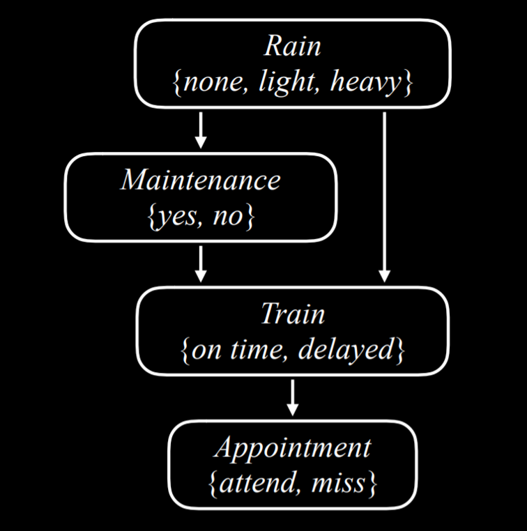
  - From the above we can come up with a probability distribution for each node based on it's parents as follows:
    - __Rain__:_R_
      - Root node
      - Probability distribution not reliant on any prior event.
       |__None__ | __Light__ | __Heavy__ |
       |---------|-----------|-----------|
       | 0.7 | 0.2 | 0.1 |

    - __Maintenance__:_M_
      - Depends on the heaviness of the rain.
      - Each row sums up to 1.
       | __R__ | __Yes__ | __No__ |
       |-------|---------|--------|
       | _none_ | 0.4 | 0.6 |
       | _light_ | 0.2 | 0.8 |
       | _heavy_ | 0.1 | 0.9 |

    - __Train__:_T_
      - Encodes whether the train is on time or delayed.
      - Depends on both the rain and maintenance and both their values affect the train.
       | __R__ | __M__ | __on time__ | __delayed__ |
       | --- | ----- | ------ | ------ |
       |_none_|_yes_|0.8|0.2|
       |_none_|_no_|0.9|0.1|
       |_light_|_yes_|0.6|0.4|
       |_light_|_no_|0.7|0.3|
       |_heavy_|_yes_|0.4|0.6|
       |_heavy_|_no_|0.5|0.5|

    - __Appointment__:
      - Encodes whether i attended or missed my appointment.
      - It's only parent is train, so it's only affected by the values of train( whether on time or delayed)
      - A bayesian network only encodes direct relationships not indirect ones.
       |__T__|__attend__|__miss__|
       |----|-----|-----|
       |_on time_|0.9|0.1|
       |_delayed_|0.6|0.4|

  - From the above i can calculate the probability of each node given it's parents.
  - __For Example__:
    - To compute joint probability:
    - __P(light, no, delayed, miss)__
      - Here were asked for the probability of light rain, no maintenance, delayed train and a missed meeting.
      - =__P(light)P(no|light)P(delayed|light,no)P(miss|delayed)__
      - =__(0.2)(0.8)(0.3)(0.4)__
      - =__0.0192__
      - =__0.02__
  - For each subsequently deepeer node, i multiply it by the probability of its parent node.
- With bayesian networks, what i might really want to do is derive new pieces of information from our knowledge base.

### Inference

- Given things that i know are probably true, can i draw conclusions about other facts about the world that i also know are probable to be true.
- Using info about which i have some knowledge can i figure out the probabilities of other variables taking on particular values.

- __Parts of inference__:
  - __Query _X___:
    - variable for which we compute the probability distribution.

  - __Evidence variable _E___:
    - this is the evidence/knowledge base
    - one or more variables observed for event _e_.
    - Eg: this can be light rain observed at the train station.

  - __Hidden variable _Y___:
    - These are the unknowns.(things that we dont know/dont have evidence about)
    - Non evidence, non query variables.
    - Eg: when im waiting for a bus, there might be an accident down the road/maintenance that i dont know about.

  - __The Goal__ _Calculate __P__(X | e)_:
    - this is the probability distribution of the query based on the evidence we have.

- __For example__:
  - I want to compute the probability distribution for an appointment given light rain and no track maintenance.
  - _Query_ :__P(_Appointment | light,no_)__
  - _Evidence_ : light rain, no track maintenance
  - _Hidden variables_: is the train delayed or not?
  - _Goal_:what's the probability distribution on me attending the appointment or missing the appointment.
  - Here we can use __marginalization__
  - Given the appointment's paren is the unknown variable.
  - We know that a conditional probability is proportional to the joint probability.
  - __P(_Appointment | light,no_)__ = __α P__(_Appointment, light, no_)
    - But we need all four values to calculate a joint distribution because appointment depends on the value of train.
    - As we know train has only two possible values. Either it's on time or delayed:
    - Therefore there are only two possible worlds for the train variable.
    - _Here we add up all the possibilities for the hidden variable_

  - =__α[_P___(_Appointment, light, no, delayed_) + __P__(_Appointment, light, no, on time)]_

#### Inference by enumeration

- The formula for the above is as shown.
- Inference by enumeration is _the process of finding the probability distribution of variable X given observed evidence e and some hidden variable Y.
  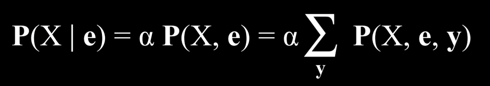
  - __X__: query variable
  - __e__: evidence
  - __y__: all possible values of the hidden variable
  - __α__: normalizes the result(multiplies by a constant so sum is 1)

  - __Explanation__:
    - I want to know what the conditional probability distribution of _X_ given _e_  which i know is equal/proportional  to a normalised joint probability distribution of _X_ and _e_.
    - To get this distribution we sum the normalised probability of _X_,_e_ and _Y_ where _y_ takes a different value each time for hidden variable _Y_.

- From  the above i can implemen a bayesian network by myself so that a computer may take over doing these complicated calculations.

__How to create a bayesian network__:(pomegranate library)

- __Step 1__: define the nodes and provide a probability distribution for each one.

    ```python
    from pomegranate import *

    # Rain node has no parents
    rain = Node(DiscreteDistribution({
        "none": 0.7,
        "light": 0.2,
        "heavy": 0.1
    }), name="rain")

    # Track maintenance node is conditional on rain
    maintenance = Node(ConditionalProbabilityTable([
        ["none", "yes", 0.4],
        ["none", "no", 0.6],
        ["light", "yes", 0.2],
        ["light", "no", 0.8],
        ["heavy", "yes", 0.1],
        ["heavy", "no", 0.9]
    ], [rain.distribution]), name="maintenance")

    # Train node is conditional on rain and maintenance
    train = Node(ConditionalProbabilityTable([
        ["none", "yes", "on time", 0.8],
        ["none", "yes", "delayed", 0.2],
        ["none", "no", "on time", 0.9],
        ["none", "no", "delayed", 0.1],
        ["light", "yes", "on time", 0.6],
        ["light", "yes", "delayed", 0.4],
        ["light", "no", "on time", 0.7],
        ["light", "no", "delayed", 0.3],
        ["heavy", "yes", "on time", 0.4],
        ["heavy", "yes", "delayed", 0.6],
        ["heavy", "no", "on time", 0.5],
        ["heavy", "no", "delayed", 0.5],
    ], [rain.distribution, maintenance.distribution]), name="train")

    # Appointment node is conditional on train
    appointment = Node(ConditionalProbabilityTable([
        ["on time", "attend", 0.9],
        ["on time", "miss", 0.1],
        ["delayed", "attend", 0.6],
        ["delayed", "miss", 0.4]
    ], [train.distribution]), name="appointment")
  ```

- __Step 2__: create a Bayesian network(model) by combining the nodes and describing which node is the parent of which by adding edges.

  ```py
  # Create a Bayesian Network and add states
  model = BayesianNetwork()
  model.add_states(rain, maintenance, train, appointment)

  # Add edges connecting nodes
  model.add_edge(rain, maintenance)
  model.add_edge(rain, train)
  model.add_edge(maintenance, train)
  model.add_edge(train, appointment)

  # Finalize model
  model.bake()
  ```

- __Step 3__: use the Bayesian network to calculate the probability of a specific event, to do this we run the model with the values were interested in(eg: P(no rain, no maintenance, on time, attend)).

  ```py
  # Calculate probability for a given observation
  probability = model.probability([["none", "no", "on time", "attend"]])

  print(probability)
  ```

- Otherwise, we could use the program to provide probability distributions for all variables given some observed evidence.
- Eg: Kb = train delayed. We can calculate the probability distributions of the variables rain, maintenance and appointment.
  
  ```py
  # Calculate predictions based on the evidence that the train was delayed
  predictions = model.predict_proba({
      "train": "delayed"
  })

  # Print predictions for each node
  for node, prediction in zip(model.states, predictions):
      if isinstance(prediction, str):
          print(f"{node.name}: {prediction}")
      else:
          print(f"{node.name}")
          for value, probability in prediction.parameters[0].items():
              print(f"    {value}: {probability:.4f}")
  ```

- In the above, changing the value of rain to heavy shouldnt affect the probability distribution for attendance.

- _It turns out that inference by enumeration is not particularly efficient for large networks. This is because the number of possible combinations of states grows exponentially with the number of nodes._( For large networks, we would need to use more efficient algorithms like message passing or variational inference.)
-We can give up __exact inference__ for __approximate inference__ thus relinquishing some precision in favour of speed.

### Approximate Inference

- Approximate inference algorithms are used when exact inference is too computationally expensive.
- We give up precision to gain an advantage in speed.
- As we gain more knowledge we become more precise

#### Sampling

- In sampling each variable is sampled for a value accoring to its probability distribution.
- In this model we take a sample of all the variables inside the bayesian network.
- Generally we pick a random value for each variable in the network based on their probability distribution.
- From this we are able to sample possible outcomes.
- For example:
  - if we start with sampling the Rain variable, the value none will be generated with probability of 0.7, the value light will be generated with probability of 0.2, and the value heavy will be generated with probability of 0.1.
  - Suppose that the sampled value we get is none.
  - When we get to the Maintenance variable, we sample it, too, but only from the probability distribution where Rain is equal to none, because this is an already sampled result.
  - We will continue to do so through all the nodes.
  - Now we have one sample, and repeating this process multiple times generates a distribution.
  - Now, if we want to answer a question, such as what is __P(Train = on time)__, we can _count the number of samples where the variable Train has the value on time_, and _divide the result by the total number of samples_. This way, we have just generated an approximate probability for P(Train = on time).

  - We can also answer questions that involve _conditional probability_, such as __P(Rain = light | Train = on time)__.
  - In this case, we _ignore all samples where the value of Train is not on time_, and then proceed as before.
  - We count how many samples have the variable Rain = light among those samples that have Train = on time, and then divide by the total number of samples where Train = on time.

##### Rejection sampling

- Basically we want to see how many times the query condition is met out of all the samples and that becomes our probability.
- With conditional probability queries though we reject all samples that dont match our evidence/condition.This is known as __rejection sampling__
- In sampling , code would llook as follows.

  ```py
  import pomegranate

  from collections import Counter

  from model import model

  def generate_sample():

      # Mapping of random variable name to sample generated
      sample = {}

      # Mapping of distribution to sample generated
      parents = {}

      # Loop over all states, assuming topological order
      for state in model.states:

          # If we have a non-root node, sample conditional on parents
          if isinstance(state.distribution, pomegranate.ConditionalProbabilityTable):
              sample[state.name] = state.distribution.sample(parent_values=parents)

          # Otherwise, just sample from the distribution alone
          else:
              sample[state.name] = state.distribution.sample()

          # Keep track of the sampled value in the parents mapping
          parents[state.distribution] = sample[state.name]

      # Return generated sample
      return sample
  ```

- Now, to compute __P(Appointment | Train = delayed)__, which is the probability distribution of the Appointment variable given that the train is delayed, we do the following:

  ```py
  # Rejection sampling
  # Compute distribution of Appointment given that train is delayed
  N = 10000
  data = []

  # Repeat sampling 10,000 times
  for i in range(N):

      # Generate a sample based on the function that we defined earlier
      sample = generate_sample()

      # If, in this sample, the variable of Train has the value delayed, save the sample. Since we are interested interested in the probability distribution of Appointment given that the train is delayed, we discard the sampled where the train was on time.
      if sample["train"] == "delayed":
          data.append(sample["appointment"])

  # Count how many times each value of the variable appeared. We can later normalize by dividing the results by the total number of saved samples to get the approximate probabilities of the variable that add up to 1.
  print(Counter(data))
  ```

- Rejection sampling has one major flaw though, if the evidence im looking for is a very rare occurence, i throw away a lot of data/samples which takes time and power to generate making it inefficient.

##### Likelihood weighting

- In this model we avoid discarding samples that dont match evience.
- We do this as follows:
  - _Start by fixing the values for evidence variables_:we dont sample evidence.
  - _Sample the non-evidence variables using conditional probabilities in the bayesian network_
  - _Weight each sample by its __likelihood__: the probability of all evidence ocuuring_(given all the evidence we have whats the likelihood of event a occurring.)
  - For example, if we have the observation that the train was on time, we will start sampling as before. We sample a value of Rain given its probability distribution, then Maintenance, but when we get to Train - we always give it the observed value, in our case, on time. Then we proceed and sample Appointment based on its probability distribution given Train = on time. Now that this sample exists, we weight it by the conditional probability of the observed variable given its sampled parents. That is, if we sampled Rain and got light, and then we sampled Maintenance and got yes, then we will weight this sample by P(Train = on time | light, yes).
  - The weight in this case is 0.6

---

## Uncertainty over time

- Practically values and probabilities change over time given prevailing circumstances.
- For example in the case of weather , i would like to know not only waht is the probablity that it rains now, but also what is the probabilty that it rains tomorrow.

### Markov Models

- In this model we have a random variable not only for the weather but also one for every possible timestep.
- __$X_t$__: weather at time t

- If ur keeping track about the weather you find that you may end up with ridiculous ammounts of data trying to infer simple conclusions.
- Therefore when trying to do this type of analysis and inference in computers it's helpful to mak some simplifying assumptions(things/info about the problem we can assume are true)

#### Markov assumption

- This is the assumption that a current state depends only on a finite/fixed number of preevious states.

#### Markov chain

- A sequence of random variables where the distribution of each varaiable follows the Markov assumption.
- This is , each event in the chain occurs based on the probability of the event before it.

- For example:
  - I can predict each day's weather based on the prior day's weather.
   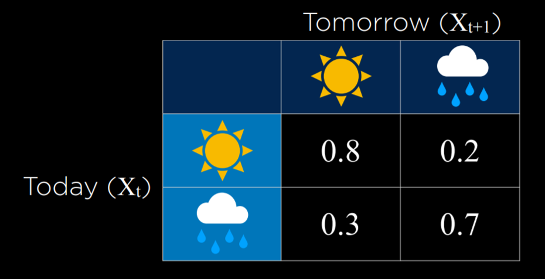

- __Transition model__:
  - this is the description of how we transidion from one state to the next.
  - This transition model specifies the probability distributions of the next event based on the possible values of the current event.

- Using the transition model we can construct a markov chain.
  - GIven today's weather whats the likelihood of tomorrow's weather.
  - We can _sample_ each days weather to form a chain using the transition model as follows.
    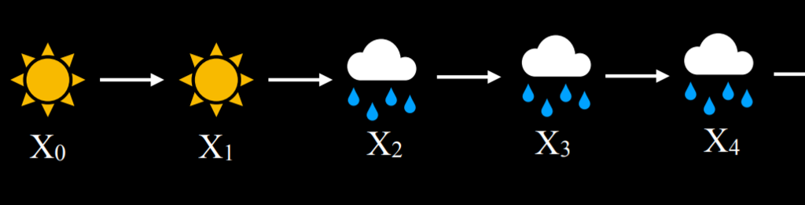

  - From this we can ask probability questions like "whats the probability of having four rainy days in a row?"
  - We can implement a markov chain as follows:

    ```py
    from pomegranate import *

    # Define starting probabilities
    start = DiscreteDistribution({
        "sun": 0.5,
        "rain": 0.5
    })

    # Define transition model
    transitions = ConditionalProbabilityTable([
        ["sun", "sun", 0.8],
        ["sun", "rain", 0.2],
        ["rain", "sun", 0.3],
        ["rain", "rain", 0.7]
    ], [start])

    # Create Markov chain
    model = MarkovChain([start, transitions])

    # Sample 50 states from chain
    print(model.sample(50))
    ```

- Markov models rely on me knowing the values of the inividual states(i know today's weather)
- In practice though this isnt often the cas and we dont usially know for certain the values of these states.
- Often the state of the world is unknown and AI depends on sensors to determine the state of the world and thus act upon it.
- The data gotten from sensors is usually related to the state of the world even though the true state of the world is unknown

### Sensor Models (Hidden markov models)

- Hiddem markov models are used for systems  with _hidden states_ that generate some _observed event_
- This is how we translate the hidden sates with the observatons.

    | __Hidden State__ | __Observation__|
    |-----|-------|
    | robot position | robot sensor data |
    | words spoken | audo waveforms |
    | user engagement | website/app analytics |
    | weather | umbrella |

- With hidden states we dont know with 100% certainty what the true state of the world is and we can only infer from our observations
- For example:
  - Say we want to determine the weather(hidden state) but our ai only has access to an indoor camera that records how many people brought umbrellas with them.
  - The _sensor/emmission model_ would be as follows:
    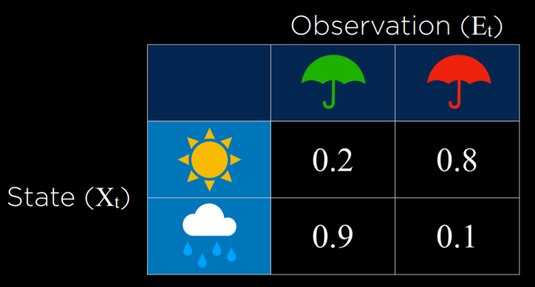
  - If it's raining people are more likely to bring umbrellas than when it isn't
  - We also use  a transition model.
  - Using the observations we can predict what the underlying state is.

#### Sensor markov assumption

- This is the assumption that the evidence variable depends only on the corresponding state.
- This may not always hold true in practice but we have to live with the assumption.

- A hidden markov model can be represented in a markov chain with two layers: the top layes variable _X_ stands for the hidden state, the bottom layer, variable _E_ stands for the evidence/observations.
  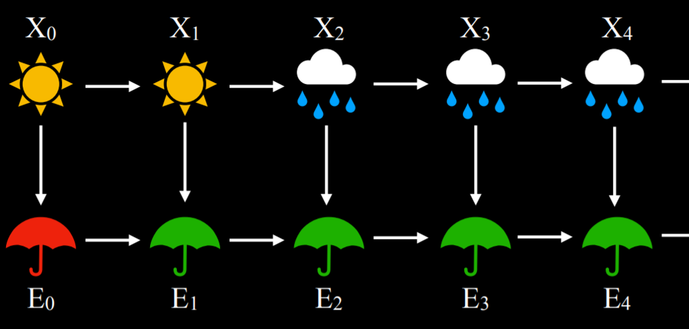
  __X__: underlying satate
  __E__: observation.

- We may want to do different tasks based on hiddem markov models:

  | __Task__ | __Definition__ |
  |------|--------|
  | _Filtering_ | given observations from start till now, calculate distribution for current state |
  | _Prediction_| given observations from start till now, calculate distribution for a furture state |
  |_Smoothing_| given observations from start till now, calculate distribution for a past state |
  |_Most likely explanation_| given distributions from start till now, calculate the most likely sequence of states|

- Most likely explanation task is used in processes such as voice recognition where , based on multiple waveforms, the AI can infer the most likely sequence of words or syllables that brought these waveforms.
- THe implementation would be as follows:
  
  ```py
  from pomegranate import *

  # Observation model for each state
  sun = DiscreteDistribution({
      "umbrella": 0.2,
      "no umbrella": 0.8
  })

  rain = DiscreteDistribution({
      "umbrella": 0.9,
      "no umbrella": 0.1
  })

  states = [sun, rain]

  # Transition model
  transitions = numpy.array(
      [[0.8, 0.2], # Tomorrow's predictions if today = sun
      [0.3, 0.7]] # Tomorrow's predictions if today = rain
  )

  # Starting probabilities
  starts = numpy.array([0.5, 0.5])

  # Create the model
  model = HiddenMarkovModel.from_matrix(
      transitions, states, starts,
      state_names=["sun", "rain"]
  )
  model.bake()
  ```

- Note the model is both the sensor and transition model.
- The following is a snippet where a sequence of observation is given and based on this sequence the model generates a most likely explanation:

  ```py
  from model import model

  # Observed data
  observations = [
      "umbrella",
      "umbrella",
      "no umbrella",
      "umbrella",
      "umbrella",
      "umbrella",
      "umbrella",
      "no umbrella",
      "no umbrella"
  ]

  # Predict underlying states
  predictions = model.predict(observations)
  for prediction in predictions:
      print(model.states[prediction].name)
  ```

- In this case, the output of the program will be rain, rain, sun, rain, rain, rain, rain, sun, sun. This output represents what is the most likely pattern of weather given our observations of people bringing or not bringing umbrellas to the building.