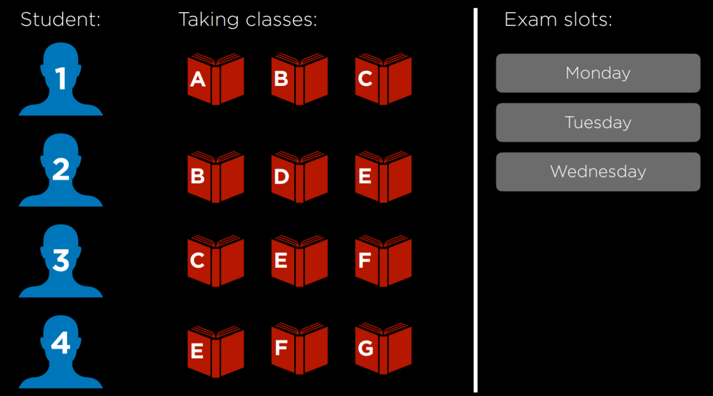
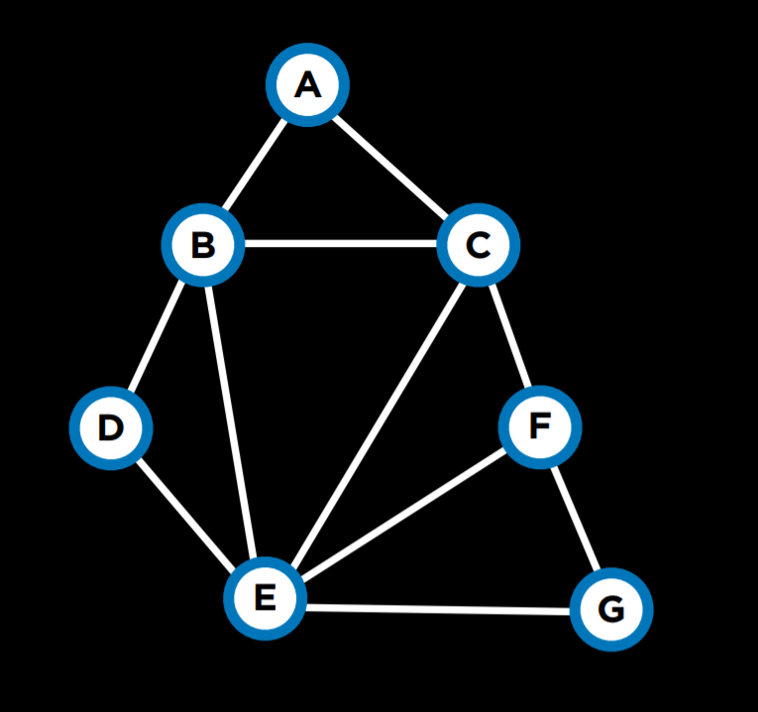
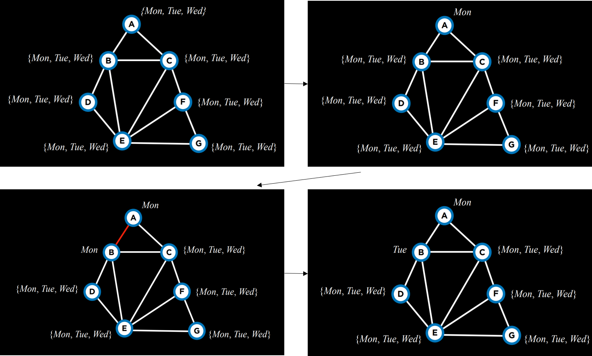
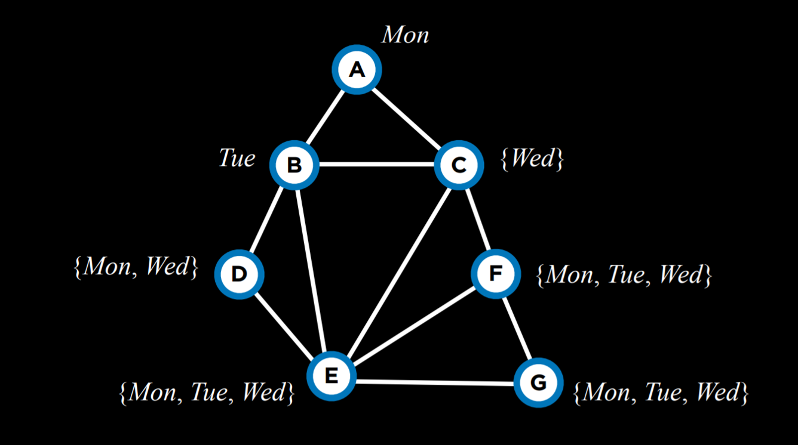
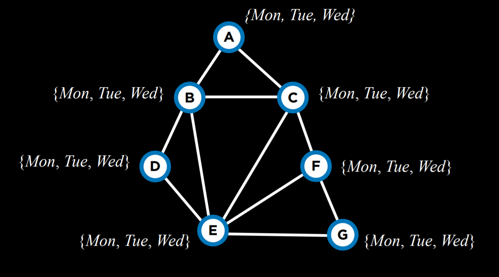
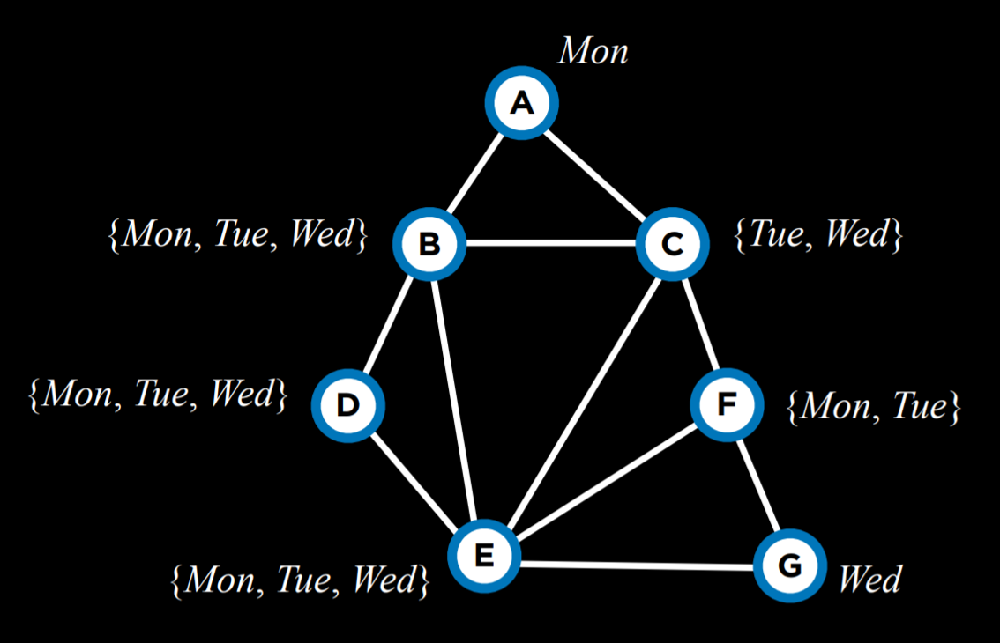

# Optimisation

- This is choosing the best option from a set of possible options.

## Local Search

- Tese are search algorithms that maintain a single node as its frontier and searches by moving to a neighboring node.
- In other search algos we maintain a plethra/list of paths that were simultaneously exploring, but in local search we focus on a single path.
- Where as in other search algorithms were trying to find the quickest path to a goal, local search tries to find the best answer to a question.
- We dont necessarily care about the path but the solution.
- For example:
  - Consider a scenario where we have houses and hospitals. We have four houses in set locations and want to build two hospitals in such a way that we minimise the distance from each house to a hospital.
  - Using the manhattan distance we can see how far each house is from a hospital:
   

  - The above is a possible configuration which brings the total cost to 17.(_we call it cost because were trying to minimise distance_)

- If we abstract away from this problem, we can represent it and problems like it as a __state-space__ landscape.
    
- Each bar represents a state and the height represents the value(cost) of the state.
- In a state space lthe following are the important terms:
  - __Objective function__: in this were trying to find a global maxima.
  - __Cost function__: in this function were trying to find a global minimum.
  - __Current state__: the state that is in current consideration.
  - __Neighbor State__: a possible state that the current state can transition to.

- __NOTE__: _local search algorithms work by considering a node in the current state and then moving to a neighbor of the current state._(unkike minimax where each state is considered recursively)

### Hill climbing Algorithm

- This is a local search algorithm where the neighbor staes are compated to the current state and if any of them is better, we transition from the current state to the neighbor state.
- The 'better' neighbor state is qualified by a function that either maximises or  minimises the value by comparing values and chosing the one that aligns to our goal.

#### Hill Climb Pseudo code

```py
function Hill_climb(problem):
    current = initial state of problem #either random or preassigned
    repeat:#we repeat this untill the algo terminates
        neighbor = best valued neighbor of current#either highest or lowest or random 
        if neighbor not better than current:
            return current
        current = neighbor
```

- In the above algo i loop till i get to a state where i cannot achieve a better neighbor(lowest/highest point relative to my neighbors).
- For the prior example, by assuming neighbors are moving the hospitals by some number of squares, we end up with the following configuration.
    
- At the current point the above algo terminates because there is no better state and subjectively 11 is better than 17.
- But objectively speaking we could achieve better result(reduce cost to 9), and this is a limitation of the hill climbing algorithm.

#### Local and global minima and maxima

- A regular hill climbing algorithm might not always give the most optimum solution and may end up getting stuck at a local minima or maxima as shown below:
  
  
- We may also end up locked in an infinite loop at flat local maximas(plateaus) or shoulders.
- Therefore instead of getting the highest or lowest values in the state space, we get the relative highest or lowest value in the local dataset according to a nodes neighbors.
- Because of these limitations, the hill climbing algorithm has a number of variations as follows:

  |__variant__|__description__|
  |-------|-------|
  |_steepest-ascent_|chooses the highest valued neighbor(described above)|
  |_Stochastic_| choses randomly from all our higher valued neighbors|
  |_first choice_|choses the first better valued neighbor and ignores all others(efficiency improved)|
  |_random restart_|conducts hill climbing multiple times. Works in union with an other algorithm. Chooses the best value gotten.|
  |_Local beam search_|keeps track of multiple nodes for search('k' highest valued neighbors)|

- With local search we may not always be 100% accurate in finding the best possible solution, but we mostly end up finding solutions that are good enough if were not overly concerned with precision.
- The biggest problem with these local search algos is that they never make a move that make our position worse.(we always consider better states)
- Sometimes though we may need to dislodge ourselves from local minimas and maximas and explore other (worse) options that may lead us to global minimas and maximas.

### Simulated Annealing

- Annealing is the process of heating metal and allowing it to cool down to toughen it.
- In a simulated annealing algo, we start in a "_heated state_" and are more likely to make random decisions(for better or worse), but as the temperature lowers and we "_cool down_" we are less likely to make random decisions, sticking to a chosen path.
- In this way we can dislode ourselves form local minima and maxima.
- Therefore we want to take more risks earlier in the move and take less risks later.

- Simulated annealing pseudocode:

  ```py
  function Simulated_Annealing(problem, max):#max= how many times to run
    current = initial state of problem
    for t = 1 to max:
        T = Temperature(t)
        neighbor = random neighbor of current
        ΔE = how much better neighbor is than current
        if ΔE > 0:
            current = neighbor
        with probability e^(ΔE/T) set current = neighbor
    return current
    ```

    Explanation:
        - The function takes as input problem and max( max times it should repeat)
        - We repeat the function max number of times
        - We calculate a temperature which takes  a time t (goes from 1 to max)
        - The temperature decreases as the time remaining decreases. (time taken increases)
        - e is for energy: how much better is the neighbor than the current state:
          - if the difference is positive, the neighbor is better and we thus just shift to them
          - if the difference is negative, that means the neighbor is worse than current, and because now we might want to make worse moves, we accept some worse state with some probability based on the temperature and the difference. (if the neighbor is much worse we might not want to choose them)
          - The most popular formula is :__e$^(ΔE/T)$__: the value gotten is a between 0 and 1

#### The travelling salesman problem

This is a problem where the task is to connect all points(nodes/houses)while choosing the shortest possibble distance from the stor to all the customer's houses and back:
    
In this case, a neighbor state might be seen as a state where two arrows swap places. Calculating every possible combination makes this problem computationally demanding (having just 10 points gives us 10!, or 3,628,800 possible routes). By using the simulated annealing algorithm, a good solution can be found for a lower computational cost.

## Linear Programming

- Linear programming is a family of problems that optiomise for a certain type of mathematical function called a __linear equation__: y = $ax_1 + bx_2 + ...$_
- Linear programming mostly comes up when we have real world numbered values(decimal values) and not just discrete values.

### components of linear programming

- __Minimising a cost function__: $c_1x_1 + c_2x_2 + ... + c_nx_n$.
- Here each $x$ is a variable and is associated with some cost $c$
- __to represent a constraint represented as a sum of vars less than or equal to a value__:$a_1x_1 +a_2x_2 + ... + a_nx_n  ≤ b$ - __or precisely equal to this value__:$a_1x_1 +a_2x_2 + ... + a_nx_n  = b$.
  - In this case, $x$ is avariable ,$a$ is some resource assiciated with it and $b$ is how much resource we can expend to solve this problem.
- __individual bounds on variables(lower and/or upper)__: for example that a var cant be negative.
  - It takes the form of $lᵢ ≤ xᵢ ≤ uᵢ$

- If you can take a propblem and format it in a way that the goal is to minimise a cost function subject to particular constraints, then you can take advantage of particular algorithms for solving these problems.

#### Linear programming example

- Two machines X1 and X2. X1 costs 50/hour tor run, X2 costs 80/hour to run.The __goal is to minimise the cost__. Formalised as: $50x_1 + 80x_2$
- X₁ requires 5 units of labor per hour. X₂ requires 2 units of labor per hour. Total of 20 units of labor to spend. This can be formalized as a __constraint__: $5x₁ + 2x₂ ≤ 20$
- X₁ produces 10 units of output per hour. X₂ produces 12 units of output per hour. Company needs 90 units of output. This is another __constraint__. Literally, it can be rewritten as $10x₁ + 12x₂ ≥ 90$. However, constraints need to be of the form $(a₁x₁ + a₂x₂ + … + aₙxₙ ≤ b)$ or $(a₁x₁ + a₂x₂ + … + aₙxₙ = b)$. Therefore, we multiply by (-1) to get to an equivalent equation of the desired form: $(-10x₁) + (-12x₂) ≤ -90$.

An optimizing algorithm for linear programming requires background knowledge in geometry and linear algebra.
To solve these problems we can take advantage of diffenrent previously developed algorithms such as __Simplex__ and __Interior-point__

If a problem can be represented as an equationn it can be solved using linear algorithms.

- The followig is a solution to the above example using scipy:

  ```py
  import scipy.optimize

  # Objective Function: 50x_1 + 80x_2
  # Constraint 1: 5x_1 + 2x_2 <= 20
  # Constraint 2: -10x_1 + -12x_2 <= -90

  result = scipy.optimize.linprog(
      [50, 80],  # Cost function: 50x_1 + 80x_2
      A_ub=[[5, 2], [-10, -12]],  # Coefficients for inequalities
      b_ub=[20, -90],  # Constraints for inequalities: 20 and -90
  )

  if result.success:
      print(f"X1: {round(result.x[0], 2)} hours")
      print(f"X2: {round(result.x[1], 2)} hours")
  else:
      print("No solution")
  ```

## Constraint Satisfaction Problems(CSP)

- This is a class of problems where variables need to be assigned values while satisfying some conditions.
- Basically we have some number of variables that need to take on some values that we need to figure out, but those variables are subject to some constraints that affect the values they can take on.

### Properties of constraint satisfaction problems

- Variables: ($x_1,x_2,...,x_n$)
- Domains per variable: {$D_1,D_2,...,D_n$}#domains can be the same or slightly different.
- Set of constraints $C$

- __Example 1.__: 
  - __sudoku__ can be represented as a constraint satisfaction problem as follows:
  - Variable = empty squares(coordinates)
  - Domain = numbers 1-9 {1,2,3,4,5,6,7,8,9}
  - Constraints = squares that cant be equal.{(0,2)!=(1,2)!=(2,0)...}

- __Example 2__:
  - Each students 1-4 is takein 3 courses.A-G
    - __Variables__ = Courses _{A,B,C,D,E,F,G}_
  - Each course needs to have an exam and the possible days are mon, tue and wen
    - __Domains__ = days _{Mon, Tues, Wen}_
  - The same student cant have two exams on the same day.
    - __Constraints__ = which courses cant be scheduled on the same day. _{$A!=B, A!=C,B!=C, B!=D, B!=E, C!=E, C!=F, D!=E, E!=F, E!=G, F!=G $}_

  - The above problem can be visualised as follows:
      

  - The problem can be represented as a graph:
    - Nodes = courses
    - Constraints = edges drawn between the nodes(edges means the nodes cant be scheduled on the same day)
  - The graph would be as follows:
      
    - The above is a constraint graph.

- In any situation where we have variables that are subject to particular constraints we can construct a CSP.

#### Types of constraints

__Hard constraint__: constraint that must be satisfied for the correct solution
__Soft constraint__: constraint that expresses a preferred solution
__Unary constraint__: constraint that involves only one variable(eg saying course A cant have an exam on Monday {$A != Monday$})
__Binary constraint__: a constraint that involves two variables. Eg (some courses cant have the same values{$A != B$})

### Node Consistency

This is when all variables in a variable's domain satisfy the variable's unary constraints.

- __Example__:
  - With two courses, A and B.
  - Each course's domain is {Mon,Tue,Wen}
  - Constraints are {A!=Mon,B!=Tue,B!=Mon,A!=B}
  - From the above knowledge, we dont have node consistency in the domains. 
  - We can solve this by taking the constraints into account and aligning our domains with the constraints.
  - If we _remove monday from A's domain_ we have node consistency in in A
  - if we _remove monday and tuesday from B's domain we achieve node consistency in B.

- Basically to achieve node consistency we align the domains with the constraints.

### Arc Consistency

This is when all values in a variable's domain satisfy the variable's binary constrains.
An arc is basically an edge.

- _To make X arc consistent with respect to Y, remove elements from X's domain until every choice for X has a possible choice for Y._

- __Example__:
  - Lets continue with our previous example.
  - Domains : A:{Tue, Wen}, B:{Wen}
  - For A to be arc-consistent with B, no matter the day A's exam is scheduled(no matter what value is picked from A's domain) B should still be able to schedule an exam.
  - If A takes the value _Tue_, B can take the value _Wen_.
  - However if A takes the value _Wen_, there is no value for B (constraint _A!=B)thus A isn't arc consistent with B.
  - To make A arc consistent with B we have to remove _Wen_ from A's domain leaving _Tue_.
    - Resulting domains: A:{Tue},B:{Wen}
  - Therefore whichever value A takes(Tue) leaves a value for B to take.(wen)

#### Arc consistency pseudo code

csp = constraint satisfaction problem

```py
function Revise(csp,X,Y):# makes x arc consistent with respect to y 
    revised = false# keep track of whether weve made a revision
    for x in X.domain:# loop over all possible values in x's domain
      if no y in Y.domain satisfies constraint for (X,Y):# remove any value that doesnt satisfy the constraint
        delete x from X.domain
        revised = true
    return revised
```

- Generally speaking though, when were enforcing arc consistency, we dont enforce for single variables but for the entire problem and variables scope.
- In this case we use an algo called AC-3:

```py
function AC-3(csp):# enforces arc consistency across an entire csp problem
  queue = all arcs in csp# all arcs that need to be made consistent
  while queue non-empty:# as long as the queue is nonempty
    (X,Y) = Dequeue(queue)# dequeue an arc from the queue
    if Revise(csp,X,Y):# make x arc consistent with y(function revise returns true if we made a change) 
      if size of X.domain == 0:# this means the problem has no solution
        return false
      for each Z in X.neighbors-{Y}:# if we revise x's domain some arcs may lose consistency so we may need to reenqueue them to check arc consistency.
        Enqueue(queue,(Z,X))
  return true# arc consistency has been enforced in the problem.
```

- Althoug the arc-consistency algo is very good, with problems that contain multiple arcs it doesnt necessarily solve the problem but simplifies it since it consides only binary constraints and not how multiple nodes may be interconnected.

- Therefore arc consistency algos generally simplify(reduces domains) the problem but dont actually solve it.

## Search Problems in csp

- To solve a constraint satisfaction problem we can consider it as a search problem.
  - __Initial state__: empty assignment(no values assigned to any variable)
  - __Actions__: add a{_variable = value_}to assignment(assign a value to a variable)
  - __Transition model__: returns the state that includes the assignment following the latest action(what happens when you take the action)
  - __Goal test__: check if all variables are assigned a value and all constraints satisfied
  - __Path cost function__: all paths have the seme cost.(we care more about the solution than the path used(the ends justifies the means))

- However implementing a csp as a regular search problem is inefficient. 
- Instead we can make use of the structure of a csp to solve it more efficiently.

### Backtracking search

Back tracking search is a search algo that takes advantage of the structure of a csp.
Back tracking search works by recursibely assigning values to variables as lon as the constraints are satisfied. 
If a constraint isn't satisfied , the algorithm backtracks to a variable it can reassign and gives it a different assignment then continues assigning recursively.

#### Backtracking search pseudocode

```py
function BACKTRACK(assignment, csp):# takes as input an empty assignment and the problem
  if assignment complete:# if all variables have been assigned
    return assignment
  var = select-unassigned-var(assignment,csp)# we select an unassigned variable
  for value in Domain-Values(var,assignment,csp):# consider all balues in a variable's domain
    if value consistent with assignment:#if the value doesnt violate any constraints
      add {var = value} to assignment# we add the assignment
      result = Backtrack(assignment,csp)# we call backtrack to see what result is(assign all other varibles)
      if result != failiure:# if the result isn't a failiure we return it
        return result
      remove {var = value} from assignment# otherwise we backtrack and reassign.
  return failiure# if all the above doesnt work w return a faililure.
```

- __Example__:
  - Consider the example we had.
      
  - Basically we start with an empty assignment.
  - We assign the first variable a value from it's domain
  - We recursively call backtrack on the following values
  - On the next variable we assign a value, if it violates a constraint we assign an other value to the variable from its domain(in this case tuesday).
  - if the value satisifies all constraints we move forward with assignment.(recursively call backtrack)
  - If no value in B satisfied the constraints, the algorithrm would backtrack and consider reassigning A a new value.
  - If all values in the original assignment return a failiure, the problem is unsolvable.
- Code can be found at: [link](https://github.com/toxxicblood/learning/blob/main/AI/cs50ai/week3/lecture/src3/scheduling/schedule0.py)
- However since CSPs are so popular, multiple libraries already  contain implementations of it.
- Using a library, the code is as follows:[link](https://github.com/toxxicblood/learning/blob/main/AI/cs50ai/week3/lecture/src3/scheduling/schedule1.py)

- To improve the efficiency of CSPs though we can be more intelligent with how we solve them.

### Inference (Maintaining Arc-consistency)

- Although backtracking is still more efficient than a simple search algorithm, it still takes a lot of computational power.
- Enforcing arc consistency though is less computationally intensive.
- By combining backtracking with inference(_enforcing arc-consistency_), we can get a more efficient algorithm.
- The inference algo is called __Maintaining Arc-Consistency__ algorithm which enforces arc consistency after every new assignment (of the backtrcking search.)
- After makeing a new assignment to X we call the AC-3 algo and start it with a queue of all arcs (Y,X) where Y is a neighbor of X.(_we dont enqueue all arcs in the problem_)

### revised backtrack algorithm:

```py
function BACKTRACK(assignment, csp):# takes as input an empty assignment and the problem
  if assignment complete:# if all variables have been assigned
    return assignment
  var = select-unassigned-var(assignment,csp)# we select an unassigned variable
  for value in Domain-Values(var,assignment,csp):# consider all balues in a variable's domain
    if value consistent with assignment:#if the value doesnt violate any constraints
      add {var = value} to assignment# we add the assignment
      inferences = inference(assignment,csp)
      if inferences != failiure:
        add inferences to assignment
      result = Backtrack(assignment,csp)# we call backtrack to see what result is(assign all other varibles)
      if result != failiure:# if the result isn't a failiure we return it
        return result
      remove {var = value}and inferences from assignment# otherwise we backtrack and reassign.
  return failiure# if all the above doesnt work w return a faililure.
```

- Inference basically takes advantage of knowledge we have initially
- When we assign a variable to a value we can use inference to reduce the domains of other variables.

----

There are additional ways to make the algorithm more efficient.
So far, we selected an unassigned variable randomly.
However, some choices are more likely to bring to a solution faster than others.
This requires the use of heuristics.
A heuristic is a rule of thumb, meaning that, more often than not, it will bring to a better result than following a naive approach, but it is not guaranteed to do so.

### Further optimisations

- we can use different heureistics to furter improve the efficiency of our algorithm
- __SELECT-UNASSIGNED-VAR()__
  - __Minimum Remaining Values(MRV)__:
    - This heuristic selects the value that has the smallest domain.
    - By making assignments for values with smaller domains we increase the likelihood that we select the correct values thus reducing the probability of backtracking further on.
    - _Example_:
      
      - With the mrv hauristic we chose to asign C next because it has the smallest domain.
  - __Degree__:
    - This is a heuristic that prioritises selecting the variable that has the highest degree.
    - A variable's degree is how many arcs connect the variable to other variables.
    - Basically were trying to find the variable connected to the most other variables.
    - In this way inference and MRV is more easily done.
    - This therefore increases the algo speed.
    - _Example_:
      
      - In the above the domain with the highest degree is E.
  
  - Both heuristics though are not always applicable eg: when multiple vars have the same number of least values or when multiple variables have the same highest degree. 

- __DOMAIN-VALUES()__
  - When selecting a value from a variable's domain we can be more intelligent
  - __Least Constraining Values__:
    - Here we select the value that will constrain the least othr variables.
    - This means we want to locate the variable with the highest degree and then assign it to the least troublesome value allowing us  to do as many assignments as we need to.
    - Basically we don't want to rule out a potential solution.
    - _Example_:
      
      - In the above, if we assign Tuesday to C we put a constraint on all B,E and F.
      - However if we chose wenesday, we put a constraint only on B and E, therefor it's probably better to go with wenesday.

----

__Summary__
 We looked at how to formulate problems.
 We formulated:
  __Local search__ we move to a neighbor based on whether its better than the current node in consideration
  __Linear programming__: we construct prblems in terms of equations and constrainsts
  __Constraint satisfaction__: creating graphs of problems by using edges to connect nodes that have constraints between them
