# WEEK 5: NEURAL NETWORKS

Neural networks are inspired by the human brain.
Scientists were trying to enable computers to think the way we humans do.
Specifically by copying neurons in the brain.
    These neurons are connected to each other forming networks
    Each neuron is capable of both sending and receiving information
    Once the electrical input of some neuron surpasses a certain threshold it activates and propagates the signal forward activating other neurons

__Artificial Neural Network(ANN)__:
this is a _mathematical_ model for learning insipired by biological neural networks.
    They model mathematical functions from inputs to outputs based on the structure and parameters of the network.
    Allow learning network's parameters based on data

- We can model our _neural network_ using units(like nodes) which can be connected to one another using edges.
- Its like nodes connected by edges.
- For the mathematical modelling, basically what were trying to do is come up with a hypothesis function for the inputs were receiving.
  - $h(x_1,x_2, ..., x_n) = w_0 + w_1x_1 + w_2x_2 + ... + w_nx_n$
  - __X__  are the input variables multiplied by individual weights
  - __w__ are the weights associated with each input
  - $w_0$ is a bias that serves to tip the result in one direction or another

To get our hypothesis function, we just need to figure out the correct weights.

## Activation functions

Activation functions are functions applied to the result of the hypothesis function
$h(x_1,x_2, ..., x_n) = g(w_0 + w_1x_1 + w_2x_2 + ... + w_nx_n)$
__g__: activation function

- To get a proper output or classification, we have do create a function that defines a threshold and is able to classify the outputs.
- Activation functions determine when outputs become active.

__Step Function__:

    - This function gives 0 before a certain threshold is reached and 1 after the threshold is reached.
    - It strictly outputs binarily 1/0

    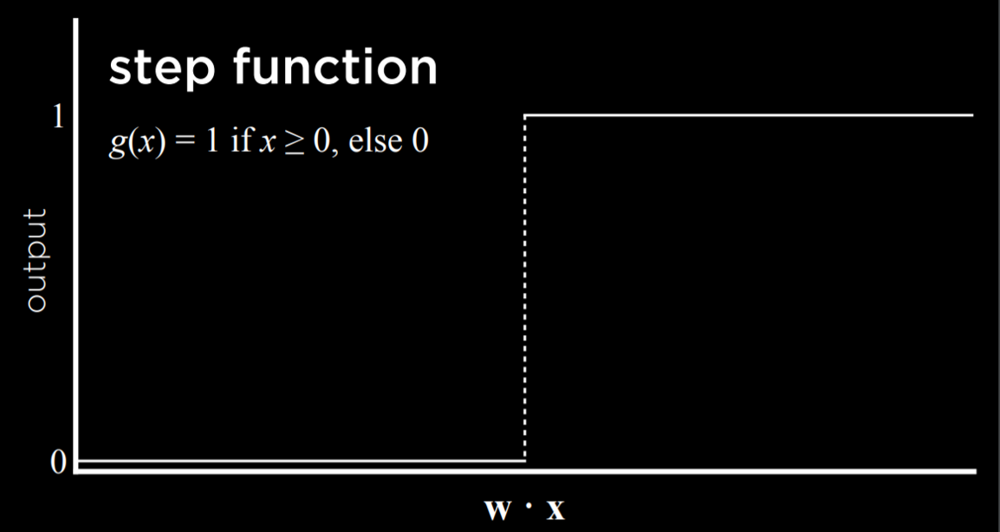

__Logistic sigmioid__:

    - If we don't want binary output, we can use a logistic function
    - it outputs real numvered values between 0 and 1 giving a graded confidence judgement. (prbability of a over b)

    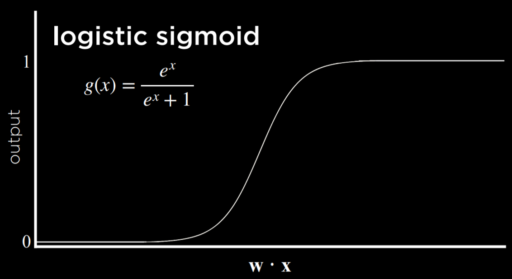

__Rectified linear unit(ReLU)__:

    - This allows the output to be the maximum positive value or 0
    - Therefore it sets negative outputs to 0

    

The above stays true for the simplest Neural Networks.

## Neural Network Structure


For example:
    - To represent an or function in a neural network.
     | __X__ | __Y__ | __f(x,y)__ |
     | ----- | ----- | ---------- |
     | 0 | 0 | 0 |
     | 0 | 1 | 1 |
     | 1 | 0 | 1 |
     | 1 | 1 | 1 |

     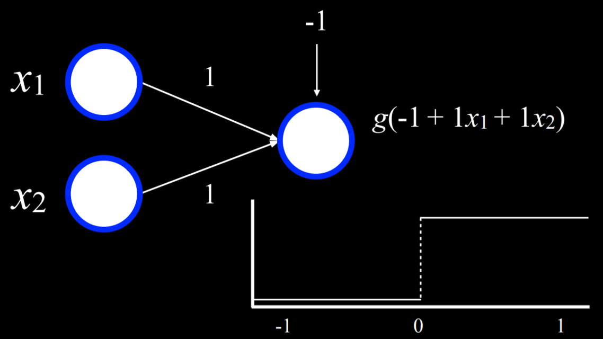

    - for _and_ we can increase the bias to -2
    - It can also extend to any number of inputs by increasing the weights multiplied by an input.

### Gradient descent

- This is an algorithm for minimising loss when training neural networks.(loss is how poorly our hypothesis models the data.)
- It is inspired by the domain of calculus.
- Using calculus we can calculate the gradient that the loss function is going and with that we can decide which direction we want the function to go to and implement minute changes that will over time improve our gradient.
The question were asking is : in which direction should we move to minimise the loss of our function.
Update the weights according to our gradient.

__Gradient descent__:
    - Start with random choice of weights
    - Repeat:
      - Calculate the gradient based on all data points:
        - find direction that will lead to decreased loss(the gradient is a vector(a sequence of numbers))
      - Update weights according to the gradient.

- The expensive/inefficient part of the above algorithm is basing the gradient calculation on all data points
- This can be very computationally expensive especially considering the large datasets it takes to train ai models and also the number of times this gradient checking has to be done. The question thus becomes how to make this a more efficient model.

__Stochastic Gradient Descent__:
    - Start with random choice of weights
    - Repeat:
      - Calculate the gradient based on _one data point_:
          - (find loss decreasing direction)
      - Update weights according to gradient

- this gives us a less accurate  asessment of the gradient but is faster than the prior algorithm.(the tradeoff is accuracy for speed)

__Mini batch gradient descent__:
    - Start with random choice of weights
    - Repeat:
      - Calculate the gradient based on _one small batch_
      - Update the weights according to gradient

- In this method we find a middle ground.
- we divide the data ito small batches that we can thus base the gradien calculation off of.
- We can thus average the speed and accuracy.

Most neural networks though dont work by outputting one binary output but by giving a probability range for a certain outcome being true: for example:
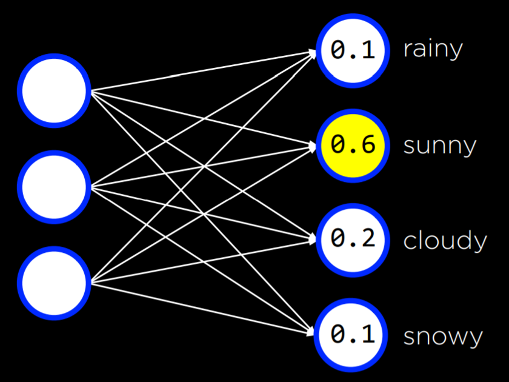

- To keep the network fully connected though we just add more weights to each edge connecting an input to an output.
- With increased inputs though we increase the number of multiplications we have to do.(more compute)

- __Anything we can frame as a mathematical function can be modeled into a neural network.__

- When you have multiple outputs in a neural network. You can thing of each output field as its own neural network with its corresponding input(s).

- When taking linear input combinations (addition) and using that to define our outputs(linear decision boundary), we can only do linear outputs/binary outputs( basically categorisations into two categories.)
- But with these models(__Perceptron__) we cant deal with more complicated data that isn't linearly separable and requires more complex decision boundaries.
Example:
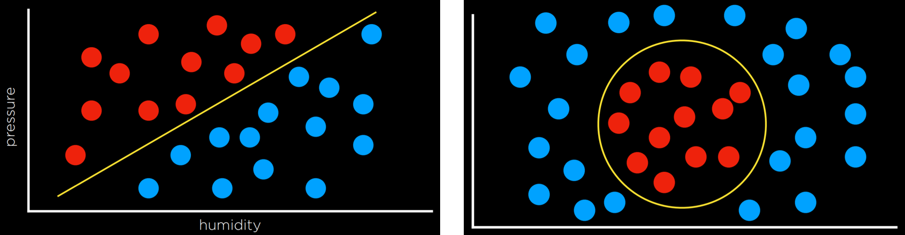
Data on the left is linearly separable but that on the right isn't.

----
__Perceptron__:only capable of learning linearly separable decision boundaries.
A perceptron model therefore cannot generalise well to real world data which is normally not linearly separable.

### Multilayer neural networks

This is an artificial neural network with an input and output layer and _at least one_ __hidden layer__.

- Instead of having the inputs directly connected to the outputs and have the weights determine the outputs, we have other layers of neurons that calculate their own values.

The programmer can choose how many nodes are in each hidden layer and how many hidden layers are required.
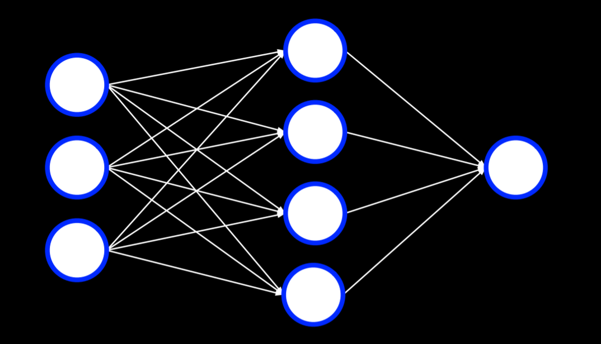
For the above:
    - inputs are weighted and passed into the hidden layer
    - The hidden layer goes through it's activation function
    - The hidden layer propagetes its output which is then weighted as the final output for the above or as input for other hidden layers.

This gives us the ability to model more complex, non linear functions.

- THe input for any number of hidden nodes is either the input from the data or the previous hidden nodes output.
- Therefore instead of just working with a single decision boundary, each hidden node can find its own decision boundary which we can combine to get a higher level boundary.
- Basically, each nodes job is to learn _one_ useful feature about the input data and form a decision boundary for that feature.

The question now becomes, How do we train a neural network that has hidden layers inside of it ?

- THe problem here is we know the values for the inputs and  expected-outputs, but we dont know what the values to expect for the hidden nodes.

The solution that came up for this problem is __backpropagation__: basically if i know the error/loss in the output node, i can _calculate an estimate_ for how much the error from the output node was caused by any particular node in the previous layer based on the values of each node's weights.

Basically if i have an output and it has a certain error margin, i can estimate how much each node from the previous hidden state contributed by checking the associated weights and thus also (ultimately)find out the values of each of those(hidden) nodes. all the way to the input.

#### Backpropagation

This is the main algo used to train neural networks with hidden layers.
Pseudo code:

    ```python
    Start with a random choice of weights
    Repeat:#while x
        calculate error for output layer
        for each layer: starting with output layer and moving inwards towards the input layer:
            propagate error back one layer: basically send error to parent layer of current layer
            Update weights.
    ```
Therefore we are able to update the weights of hidden layers.
The above algorithm is the one that makes neural networks possible.
It enables training multilevel neural structures.

__Deep neural Networks__: these are networks with multiple hidden layers that work by using backpropagation.__Deep learnning__

- Deep neural networks are able to model higher level complexity functions.
- Basically then deep learning is about using larger neural networks to enable each node to concentrate on even more minute deatils and changes and form decision boundaries around these changes.
- Therefore we can calculate more sophisticated data.

#### Overfitting

- This occurs when an ai model fits to a set of data too well and doesn't generalise to other data.
- We maye become over reliant on certain nodes to give us our output.

__Dropout__:
    - This is a techique where we temporarily remove randomly selected units/nodes from the network to prevent over-reliance on them.
    - We randomly pick some percentage of nodes that should be ommitted in each layer.
    - When a node is ommitted, its weights are also ommitted.
    - After training, the units are restored for testing or deployment.

----

## Tensor Flow

Here is some code:
[link](https://github.com/toxxicblood/learning/blob/main/AI/cs50ai/week5/lecture/src5/banknotes/banknotes.py)

This is a python library that enables coders to work with neural networks
We use a __keras__ api which is a set of functions that we can use to manipulate neural networks inside tensorflow.

Sequential neural networks: one layer after the next.
Dense layer: each node inside this layer is connected to each node from the previous layer.

With neural networks we have to strike a balance:
    - Even though adding more nodes enables us to model more complex functions, we have to consider that with each additional node comes an associated weight making it more expensive to compute and also we run the risk of overfitting the data.
    - Therefore we test our neural networks to see which settings performs best.
    - Basically with neural networks we have to test every seting to see the most optimal setting that yields the best results without skyrocketing the compute or lowering the efficiency and accuracy that we target.
    - Also it is good to understand the problem were aiming to solve with our neural networks that way we are better able to model our solutions to firstly encompass the entire problem scope and secondly, minimise on wastage and inefficiency.
    - Also with each layer in a neural network we can decice on a different set of rules(activation functions) that will give us the best output

## COMPUTER VISION

These are computational methods for analysing and understanding digital images.
Computer vision is basically taking an image and figuring out what sort of calculations we can do with that image

- With this we can solve problems like hand writing recognition, object recognition etc.

Basically a computer doesn't see pictures the way we do, so we have to find a way to give the computer vision(make it see and understand the way we do.)

The question now becomes: how can we use neural networks to process image data:
    - Remember neural networks only take numerical data as input
    - Also ralize that an image is basically a grid of pixels where each pixel has some sort of color.
    - Based on how the dots/pixels are shaded, we can infer glyphs and (in the case of handwriting recognition) and features in the case of object recognition.
    - The color of each pixel can be numerically represented by the  RGB  scale number.
    - Any pixel therefore can be represented by three numerical values ranging from 0-255
    - therefore we can design a neural network where each pixel can have 1-3 inputs connected to a deep neural network, the output can be neurons classifying the object in the image.
        - The above approach has a few drawbacks:
          - The size of the input array thus a lot of weights to calculate leading to inefficient and expensive
          - We also lose the image structure by flattening it for input and cant process information contained in the image
          - This makes it a lot more difficult for the computer to understand the image.
    - It is better if we use the properties of the image to understand it.

### Image Convolution

This is the application of filters on an image to extract useful features of the image.

- This is done by applying a filter that adds each pixel value of an image to it's neighbors, weighted according to a kernel matrix.
  - If youre like me then youre wondering, "What the fuck does that mean."
  - Let's break it down:
    - 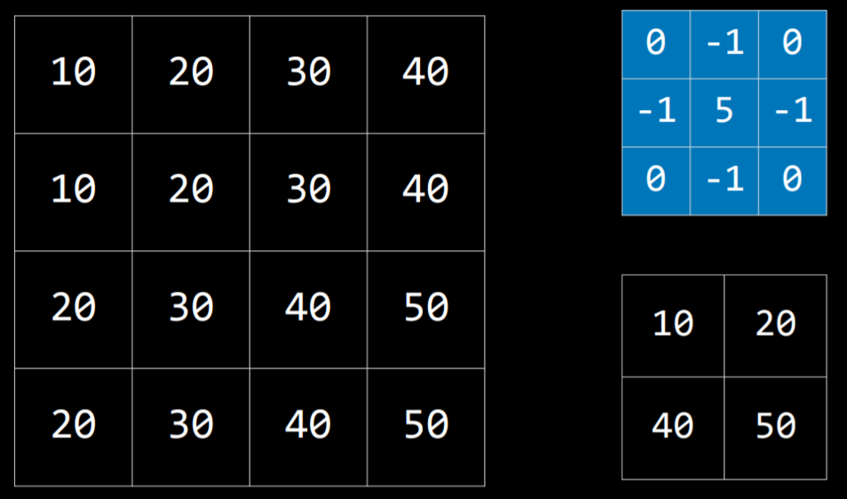
    - The following is a __kernel matrix__ for edge detection: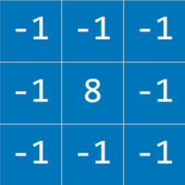
      - What we do with a kernel matrix is this:

            ```py
            go to the first index
            place the kernel maxrix over a number of pixels according to its grid-size
            repeat: #do till end:
                multiply each corresponding pixel with the value on the grid overlaid on it.
                sum up the resulting values to get a final figure that summarises what that grid of pixels contain.
                moove the kernel matrix over one step.(the step can be any size)
            ```
    - How it works:(the edge detector)
      - When a lot of pixels are the same value we end up with a value close to 0
      - When the middle value is different from its neighboring values, we get a value higher therefore we can detect things like boundaries between objects.
      - Here  is some code to demo:
        - [link](https://github.com/toxxicblood/learning/blob/main/AI/cs50ai/week5/lecture/src5/convolution/filter.py)

      - We can have kernels for each rgb value looking for certain colors.
      - Basically we can use filters to sensitize certain parts of an image, maybe shapes, colors or objects that the ml algo can use to understand the image.

Still even after filtering the image we still have some setbacks:
    - The image is still quite big and is a large input and thus computationally expensive
    - We also need to care about what is in each particular pixel

- Realisically though, we dont care what pixel an object is in, we just care about which features are in which regions of an image.

### Pooling

This is the process of reducing the size of an input by sampling from regions in the input.

- Basically were turning a bigger image into a smaller image.

__Max-Pooling__:
    - This is pooling by choosing the maximum value in each region.
    - For example:
      - In the following image i max pool by placing the 2x2 grid over each 2x2 box on the larger grid and take the maximum value in each area:
        - 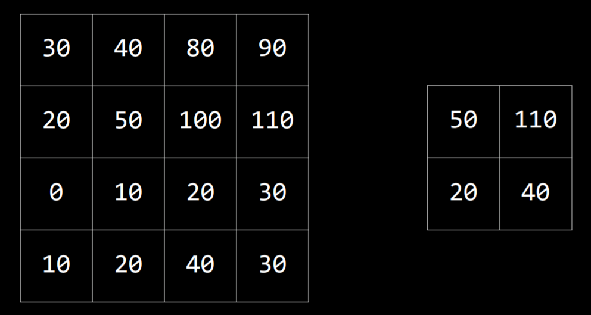

We can also do __average pooling__ or other methods to get optimum solutions.
With pooling we solve the problem of input size.

## Convolutional Neural Networks

These ar neural networks that use convolution,usually for analyzing images.
How it works:
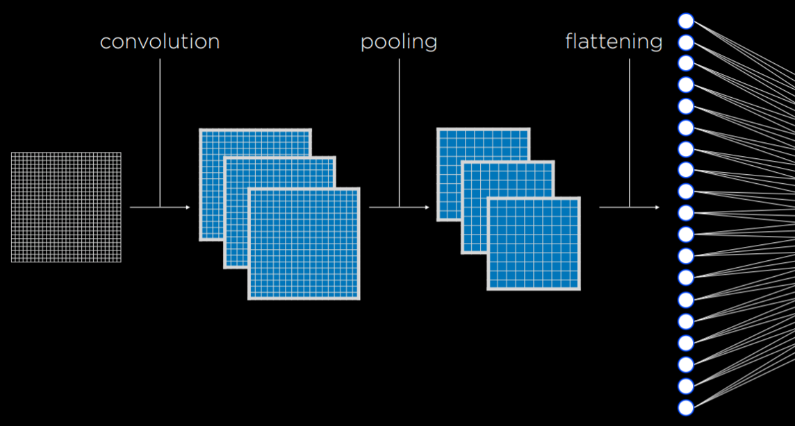

- We start by applying filters multiple times using different kernels to get different __feature maps__(highlighting features)
  - these kernels can be improved in the same way as weights in a neural network by adjusting according to error rate
- Resulting images are pooled (reduced input size)
- The pooled pixels are fed to a traditional neural network as input in a process called __flattening__

- In practice, convolution and pooling can be repeated multiple times to extract additional features and reduce input size to the neural network.
- One of the main benefit in doing this is the network becomes less sensitive to variaion.

Through convolution and pooling we can use our image knowledge to coerce better results from these steps.

- With multiple convolution and pooling steps. We can do different tasks with each step :
  - Like learning low level features:edges, curves, shapes with the first step
  - higher level features like objects and higher level shapes.

Here is some code for a handwriting recognition algo:
[handwriting.py](https://github.com/toxxicblood/learning/blob/main/AI/cs50ai/week5/lecture/src5/digits/handwriting.py)

If im using my own images, i have to format them in a way that they are an array of pixels.

- When the program is run the training process takes time showing how much compute training neural networks takes and hence the reliance on GPUs and also why more data is helpful: the more the data, the better we can train an ai model.

We can test how well the neural network performs with the recognition.py code as follows:
[recognition.py](https://github.com/toxxicblood/learning/blob/main/AI/cs50ai/week5/lecture/src5/digits/recognition.py)

## Recurrent Neural Networks

The neural networks we have studied so far are called __Feed forward neural networks__
This is where we have an input into a network that processes the data and gives an output!
These neural networks only have connections in one direction
THese networks are very useful in solving classification problems.
THey have some limitations though like having the input and output must be of a fixed shape/ number of neurons(we cant change the input and output sizes over different runs of the network)

[alt text](image-13.png)

__Recurrent neural networks__ though or __RNNs__ are neural networks that feed their outputs back into the network as input to be used to process furture data.

- In traditional neural networks the only thing that determines the output is the inputs we are given and the calculations  we do within the network.

- In recurrent neural networks, output from past runs is fed back as input allowing the neural network to maintain some state and store info that can be useful on furture runs of the algo.
- This perk is particularly helpful when dealing with sequences of data where _context_ may be useful.
- Here is a link to an __RNN__ bot: [RclntNrlNt](https://www.captionbot.ai/)

- Realise that this is not just classification. Through this, the neural network is given a semblance of understanding and comprehension.
- We also dont have fixed size inputs and outputs, thus we can give inputs of varying size and give a range of outputs.
- __RNNs__ allow us to do a _one to many_ relationship for inputs to outputs where one input value can give us a sequence of outputs or a sequence of inputs can give one output.

Therefore we can give an input to a __RNN__ and it would process the input, give an output which is fed back as input and repeat this process as many times as necessary to gain a full understanding of the input
The blelow image, the output is fed back into the network to generate new outputs.
represents one input to many outputs.
I can output the sequence one at a time.

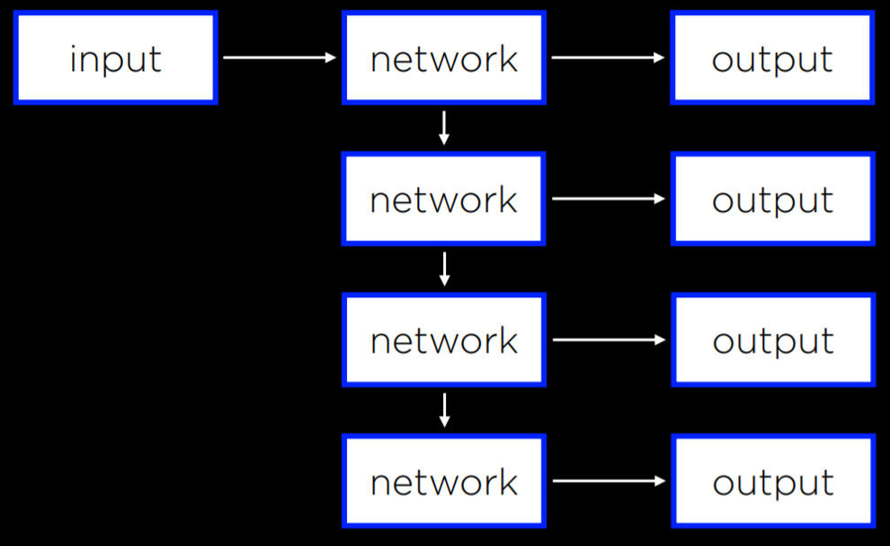

----
This can be used in processing of videos where the last frame's processed output or the unprocessed last frame that can be used as input to the next frame and so on.
Here we can use the input as a sequence and give one output or a sequence of outputs
Here wen can teach the neural network how to extract patterns from a sequence of data.
We can take the input one at a time and give one output.

- A good example is like google translate where context and dialect rules are understood in translating words form one language to another, rather than butchering the sentence through direct translation.
