# Lecture 6: Language

This is how we can get computers to understand how we communicate as humans.
This involves understanding nuance, context and culture while also being able to maintaing accuracy and minimise compute.

- Natural language though contains a lot of nuance and complexity that makes it challenging for computers to understand

## Natural language Processing

These are tasks where the AI agent gets human language as input.
Eg:
    - _Automatic summarisation_: summarise inputted text
    - _Information extraction_: extract data from inputted text
    - _Language identification_: return language of input text
    - _Machine translation_: translate input language text to target language text
    - _Named entity recognition_: extract entity names from text
    - _Speech recognition_: recognise words spoken and output in text
    - _Text classification_: classify text given into a category
    - _Word sense disambiguation_: choose the right meaning for an inputted word that has multiple meanings.
    - _Question answering_: input = question, output = answer(understanding the question, context and meaning)
    - _Etc..._

- _To get computers to process language we might have to think about language in general and start finding what kinds of challanges we might have to deal with as we find ways to get computers to understand language_

### Syntax and semantics

__Syntax__ is all about the structure of language and its components.
    - Language is composed of individual words which are put together into some sort of structured whole.
    - I want the computer to understand the _structure_
      - Like what's the difference between a grammatically correct sentence and one that's not.
        - Eg:
          - "_I am going home._"- correct
          - "_I going am home_" - incorrect
          - "_Am i going home_" - question
    - Also some sentences can be interpreted in different ways...thus having multiple valid structures
      - Eg: "_I saw the man on the mountain with a telescope_"- different meanings.

__Semantics__ is all about the meaning of language.(words and sentences)
    - It's not enough if a computer knows how a sentence is structured if it cant understand the meaning.
      - Eg: _Colorless green ideas sleep furiously_- syntactically correct. __0__ meaning.

- How then do we teach a computer to understand the structure and meaning of natural language.
  - We can start by thinking about the rules that govern natural language.
  - By formalising these rules, a computer can get to understand how language structure can be achieved.

#### Context-Free grammar

__Formal grammar__: a system of rules for generating sentences in a language
    - This is a rule based approach to NLP
    - We give the computer the rules we know about language and these help the computer make sense of the structure of language.
In __context-free grammar__ , text is _abstracted from its meaning_ to represent the _structure_ of the sentence using formal grammar.

- Example:
     N   V   D   N
     |   |   |   |
  - She saw the city.= (sentence)
    - Each word is referred to as a __terminal symbol__(after each word is generated there's nothing more to generate). Each word is associated to a _non terminal symbol_ that generates it.
    - We  break the above down into its composing syntax tree
    - Start by assingng each word it's part of speech
    - Basically associating each _terminal symbol_ with a _non-terminal symbol_
      - She = Noun(N)
      - saw = Verb(V)
      - the = Determiner(D)
      - city = Noun(N)
    - Each non terminal symbol can generate a terminal symbol

__Rewriting rules__ these are associations between non terminal symbols and terminal symbols simply depicting what the non terminal symbols can be replaced with.
    - The different words are separated using vertical bars.
We can also have non terminal symbols replaced by non terminal symbols.
    - This is how words in a sentence connect to each other..via phrases.
    - From this we have:
      -  __NP__: Noun phrase
         -  A group of words that connect to a noun
         -  __NP__-> N | DN
            -  A noun phrase is replaced by either a noun or a determiner and noun combo
      -  __VP__: Verb phrase
         -  A group of words that connect to a verb
         -  __VP__ -> V | V NP
         -  A verb can be just a verb, or a verb followed by a noun phrase.

- And this is what forms a sentence, Phrases.
  - Basically : __S__ -> NP VP
    - A sentence is made up of a noun phrase followed by a verb phrase.
    - 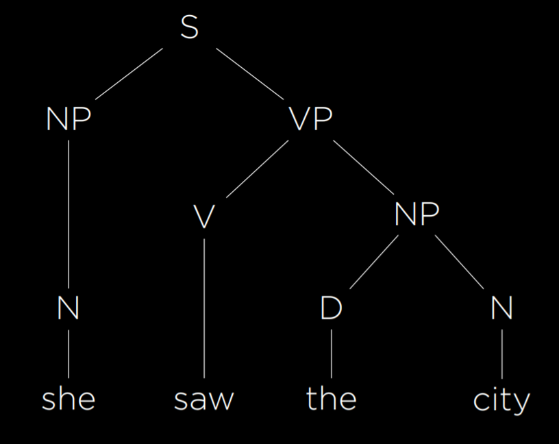

Using the above formal rules, AI is able to represent sentence structure and therefore understand the syntax of sentences

##### nltk

This is a __natural language toolkit__ which is used to process natural language.
We do this by providing the grammar rules and it can critique our grammar.
For now we will use it to parse context free grammar.
Here is some code to work with
[nltk0](https://github.com/toxxicblood/learning/blob/main/AI/cs50ai/week6/lecture/src6/cfg/cfg0.py)
[nltk1](https://github.com/toxxicblood/learning/blob/main/AI/cs50ai/week6/lecture/src6/cfg/cfg1.py)

- nltk thoug has one major constranit, it would involve us in writing all the rules and this may proove to be a tedious task for all possible sentences.
To tackle this, we may adopt a more statistical pov
If we gave the computer a lot of written content/data, what could the computer learn about language.
- It might be difficult to process long pieces of text data at once, so we might want to break it down into consumable chunks.

##### Tokenisation

This is the task of splitting a sequence of characters into pieces/tokens.
These tokens can be looked at to gauge the structure of language.

- We use tokenisation to create n-grams since they depend on tokens.
- Tokenisation can be very complicated because it involves understanding sentence structure and punctuation importance.

##### _n_-gram

An _n_-gram is a contiguous sequence of _n_ items from a sample of text.
    A _unigram , bigram_ and _trigram_ are sequences of one,two and three items .
    The following is an example of an trigram:
    _Sentence_: "How often have I said to you that when you have eliminated the impossible whatever rimains, however improbable, must be the truth?"
    _n_-grams(_trigrams_): "how often have", "often have I", "have I said"...etc.

- If we gave a computer a large corpus of text that was subdivided into such trigrams, it could gain an understanding on what sort of words tend to appear next to each other and as a result get some sense of __language structure__
Here is some code you can play with.
[ngrams](https://github.com/toxxicblood/learning/blob/main/AI/cs50ai/week6/lecture/src6/cfg/cfg0.py)

##### Markov models

Once done with tokenisation and n-grams, we can build markov chains.

- Markov chains consist of nodes whose value is based on the values of a finite number of previous nodes.
- Basically in markov chains we can predict a value based on the values that came before it. This can be done with the help of _n_-grams.
- Therefore we can build markov chains for language that follow the same statistical patterns as the input data.

Here is some such code:
[markov](https://github.com/toxxicblood/learning/blob/main/AI/cs50ai/week6/lecture/src6/markov/generator.py)

The problem with these models is that we cant always generate meaningful or comprehensible sentences.
Basically at this point its all gippidy goop.

### Text classification (__Bag-of-words model__)

Here we have text that we want to label/ categorise.
The use-cases for this is spam filtering in messaging apps and email.
Another use case is sentiment analysis, basically we want to know whether the sentiment of some text is positive or negative for example: product reviews which we want to know if theyr'e positive or negative.

- We would like the computer to understand the meaning of the text and categorise the text.
- How can i train the computer to understand word meaning without going to the length of using all the memory in the universe.

The human way of understanding text is by having particular cue words that give away the sentiment of the text we read.

- In the same way we can train a computer to spot words that tend to be associated with positive or negative messages
- Basically were trying to explain to the computer the implied meanings of words and hope to the high heavens that sarcasm never existed nor is entandre a thang.

The __bag of words model__ represents text as an unordered collection of words.
In this model, the sequence and order of words is not preserved.
We use the bag of words model to build a _naive bayes classifier._
_And what the FUCK is that you may ask...well im glad you asked:_

#### Naive bayes classifier

This is a tool that allows us to classify text based on bayes rule.

- No fuckin shit...it's not like it has bayes in the name or summ.

Just bear with me for a sec:
In lecture 2 we leart the following:
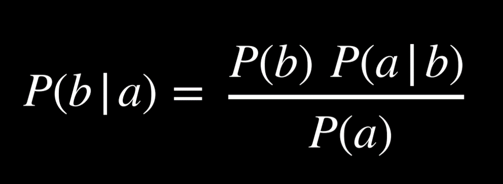

- _So what the fuck is all this for you may ask_:
Well here it is:
  - Were interested in a message either having a positive or negative sentiment given a set of words that imply positivity or negativity.
  - Basically, what is the probability that im fuckin pissed given i said "this thing is shit" in the review.
  - Where the bag of words comes in is basically, igonring syntax, what is the probability that the review is positive given this random bag of words.
- Refer to lecture for better explanation.
I will digress though that the naivety of this approach stems from the fact that we make the assumption that the words (probabilities) are independent of each other , which in practice is not the case.
THe words only depend on the sentiment being positive or negative.

Therefore we come up with an expression similar to the following:
  $P(sentiment | text)  is naively proportional to  P(sentiment)* P("word" | sentiment) for each word in the text$
  Basically were checking the probability of getting a word like "love"/"hate" given the sentiment is positive thus crosschecking each word's match to the sentiment.

One problem that we can run into is that some words may never appear in a certain type of sentence. Suppose none of the positive sentences in our sample had the word “grandson.” Then, P(“grandson” | positive) = 0, and when computing the probability of the sentence being positive we will get 0. However, this is not the case in reality (not all sentences mentioning grandsons are negative). One way to go about this problem is with __Additive Smoothing__, where we add a value α to each value in our distribution to smooth the data. This way, even if a certain value is 0, by adding α to it we won’t be multiplying the whole probability for a positive or negative sentence by 0. A specific type of additive smoothing, __Laplace Smoothing__ adds 1 to each value in our distribution, pretending that all values have been observed at least once.

In the above approach though we make a lot of assumptions.
Quasson is, can we make a model that understands the inherent nature of words.
Can we use ML tools to take better advantage of language data, draw more accurate conclusions and solve new tasks and problems

### Word Representation

As you know, computers tend to communicate in binary and work better with numbers.
Also AI input is usually in the form of numbers not words.
So we want to find a way to convert words to numbers

__One hot representation__:
  This is the representation of a word with a vetor that consists of a single 1 and the other values as 0s representing the number of words in the text input.
  Here we end up with a unique representation for each word.
  For example:
      "He wrote a book"
        $[1,0,0,0](he)$
        $[0,1,0,0](wrote)$
        $[0,0,1,0](a)$
        $[0,0,0,1](book)$
  THe problem though with one hot representation is it is memory inefficient.
  If we had a dictionary with 50000 words, we would have 50000 vectors of length 50000.
  The larger the vocab, the larger the vectors

- Also it should be the case that if i want  to represent a word's meaninig as a vector, words that have similar meanings should have similar vector representations
- Basically if we were to plot these vectors, the closer the meanings, the closer the vectors should be.

__Distributed representation__:
  Representations of meaning distributed across multiple values.
  Here each word is associated with some vector of values with the meaning distributed across multiple values.
  Here each vector has a limited number of unique values making it smaller and more concise.
  Also were able to represent similarity by how different the values in vectors are.
  For example:
    "He wrote a book"
      $[-0.34, -0.08, 0.02, -0.18, …](he)$
      $[-0.27, 0.40, 0.00, -0.65, …](wrote)$
      $[-0.12, -0.25, 0.29, -0.09, …](a)$
      $[-0.23, -0.16, -0.05, -0.57, …](book)$

- The question that arises here is how do we come up with these values.
- How can we define the meaning of a word by a vector.

"You shall know a word by the company it keeps."$_J._R._F_i_r_t_h,_1_9_5_7$

- _We are going to define the meaning of a word based on the words that appear around it._(the context)
- If words appear in a similar context, we assume they have a similar meaning

And this is sumn a computer can understand, looking at text, words with similar contexts can be represented as similar.

#### word2vec

Tis is a model for generating word vectors
Basically an algorithm that takes in words and generates their distributed vector representations.

It uses the __Skip-Gram Architecture__:
  Neural network architecture for predicting context given a target word.
  THe neural network has an input unit for every target word, a smaller single hidden layer(50-100 units) that generates values that represent distributed representations of the words.
  The hidden and output layers are _densely_ connected.
  Output layer generates words that are likely to appear in a  similar context  as the target words.
  This network needs to be trained.
  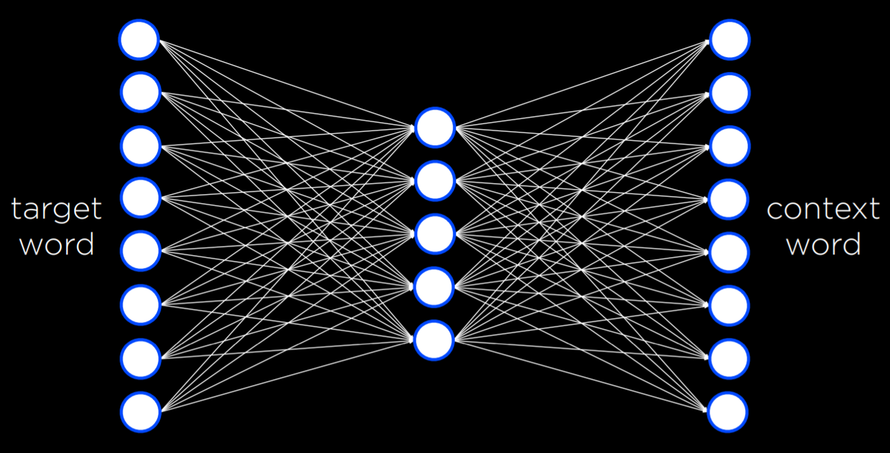

- Basically if all the words start out in random positions in a state space, when training occurs the algo learns the words that appear in similar contexts and it moves the vectors around in such a way that words with similar contexts appear closet to each other.

In the link below is a pre trained model that we can use to demonstrate the above.
[word2vec](https://github.com/toxxicblood/learning/blob/main/AI/cs50ai/week6/lecture/src6/vectors/words.txt)

if the vector function works as intended, we should be able to run a function that will generate words similar to our target words.

With this now , we have gotten computers to understand semantic similarities between words in the human language, getting us closer to AI understanding and producing human language.

### Neural networks

Now that we can rep words as numbers, we can pass these numbers as inputs to neural networks.
Basically a neural net takes some input, passes it to the netword and creates some output.
The training data input is used to update weights in the network to make it more accurate in translating inputs to outputs.

Neural networks are commonly used in word translation because, in different languages, words are arranged differently, thus using the neural network to translate an english sentence to a french one taking into account context.
Basically, sentences in different languages are not the same length though they may mean the same thing.
Also remember neural networks give a fixed output length.
This is where we use __recurrent neural networks(RNN)__ to translate sentences.
This is also valid for question answering and such tasks.

- iN the RNN we keep track of a hidden state that is passed from one run of the neural network to the next, keeping track of all the relevand info.

__Encoder-decoder architecture__:
  We encode the input into a hidden state then we decode the hidden state into our desired output.
  __End token($<end>$)__: when the inputs are passed and encoded, the end token is passed to indicate the completion of inputs and thus beginning the decoding process and giving outputs.

- In inputs as each word is passed into the neural network, an encoded hidden state is produced and passed as input into the next run of the neural network along with the subsequent word in the input.
- This repeats till the end of the input where the end token is passed , decoding begins and the first output is generated along with a hidden state.
- The first output is used as input to the next run of the decoding process along with the hidden state.
- This process goes on for each subsequent run of the decoding network.
- When all outputs have been generated, we pass the last word into the decoding network along with the hidden state and the ouptud is an end token.
- Here is an image of it:
  - 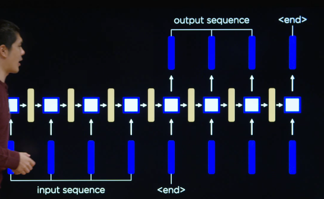

- There is though a major flaw with this model, we encode the all the input into one final hidden state before decoding begins.
This is memory inefficient and if any corrupt info is in this hidden state, it riks giving the wrong output.
Instead we should b able to refer to all previous hidden values of the encoding process

- Another problem is that some of the hidden states in the input are more important than others depending on what word they most closely correspond to .
- Also in the decoding sequence, depending on what word were outputting, different words in the input might be more or less important.

THerefore we want to be able to decide which hidden state we want to pay _attention_ to

#### Attention models

This refers to the neural network's ability to decide what values are more important than others in the sentence
Attention allows a neural network to decide what values of the input sequence it will pay attention to at each stage of the output sequence.

- The attention mechanism allows us to calculate the attention scores by  multiplying them by the hidden state values generted by the network and addin them up, the neural network creates a final context vector that the decoder can use to calculate the final word.

The attention score is some value, corresponding to each input word that determines how much atention we should pay to that word depending on how relevant it is to our current output sequence.

THese attention mechanisms can range all the way from neural networks to dot products.

With this we can do weighted averages to produce a hidden state that takes into account the attention
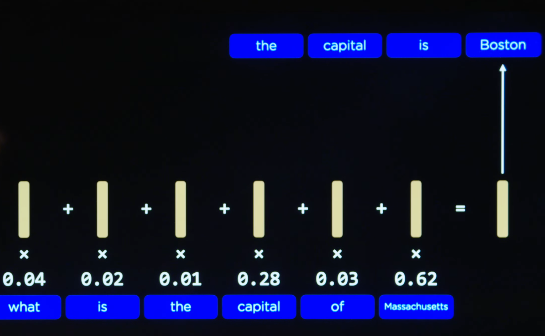

This was mostly used in the translation from english to french with attention scores being colored lighter as follows.
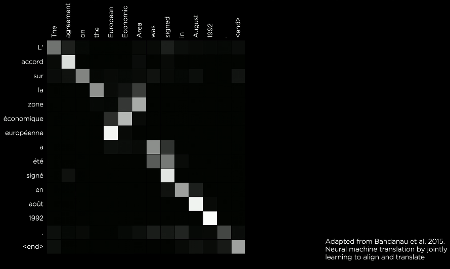

When we combine the attention model with neural networks, we can get very useful results.

There are still flaws with using the above.
A challenge that arises in calculations such as these is that recurrent neural networks require sequential training of word after word. This takes a lot of time. With the growth of large language models, they take longer and longer to train. A desire for parallelism has steadily grown as larger and larger datasets need to be trained. Hence, a new architecture has been introduced.

- Every run depends on the output of the previous run, this means paralelising this process if very difficult, and in the case of LLMs it takes ages before all input is taken for output to be given
- Also the calculations done are very computationally intensive.

#### Transformer models

Transformers allow us to process each word independently rather than simultaneously .
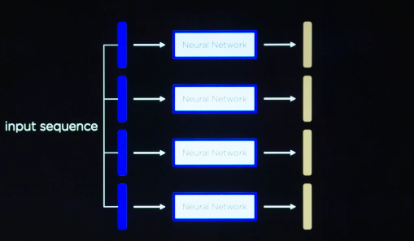

For each word:
  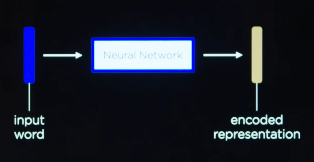
  But with this method we loose all notion of word ordering and thus context.
  To counter this we can add some _positional encoding_ to the word.
  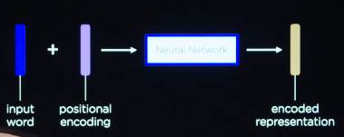
  __Positional encoding__ a vector that represents the position of the word in the input sentence.
  Therefore when this is passed into the neural network, it knows both the word and where it appears in the neural network
  __Self attention__: this step is added to help define the context of the input word.
  It pays attention to other words in the input
  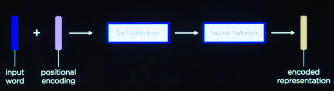
  Infact neural networks often use multiple different self attention steps to better understand context.
  This is called _multiheaded attention_ where each attention head can pay attention to summ different.
  And in deep learning, the multiheaded attention and neural network process can both b repeated multiple times to get a deeper understanding and thus more useful eneoded representations of the words
  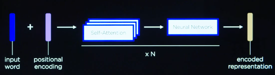
  The above is a representation of the process the transformer uses which is repeated for all input words.
  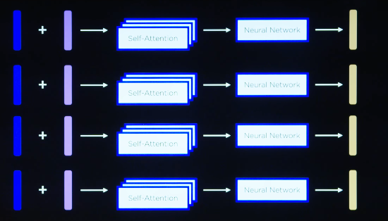
  The encoded representations are then used in decodeing process which has a very similar structure.
  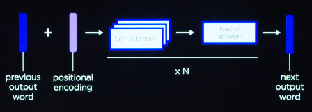
  In the decoding process though we add an additional step,an attention step that pays attendtion to the encoded representations.
  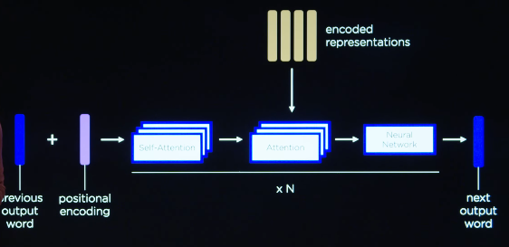

  The input and output steps therefore come togethr in some sort of beautiful melancholy of attention steps thus creaing a transformer model
  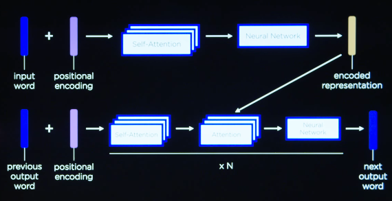
  Hence, words are able to pay attention to each other. Further, parallel processing is possible, and the calculations are fast and accurate. 