# Mit Introduction to Deep Learning

This is the voice clone chat that the intro lecture uses:
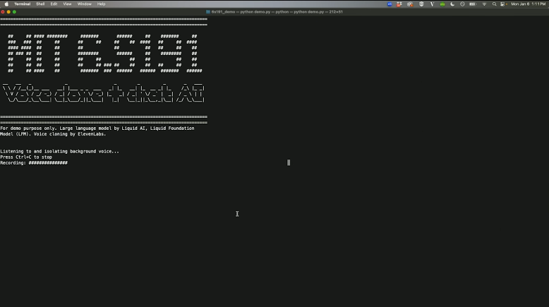

Intelligence - The ability to process information that can influence some furture decisios.
__AI__ -> Any technique that allows a computer to mimick human behaviour
__ML__ -> The ability of a computer to learn without explicitly programming it but by providing annotated data
__Deep Learning__ -> This is the ability of an algo to extract patterns from data and use the patterns learned to vet furture data.

- Deep learning is basically teaching computers how to do tasks directly from observation/data.

## The perceptron

We first multiply our inputs with our weights.
We add in the bias term that is used to shift left and right along our activation function.
The equation can be vectorised as follows: 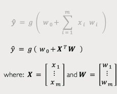
The non linearity is a function used to qualify the outputs.
Here are some :

Activation functions are used to introduce nonlinearities that can separate complex data .
For example:
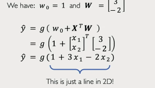
Which can be plotted as follows:

The separation happens between 0 and 1

In short here is a simplification:
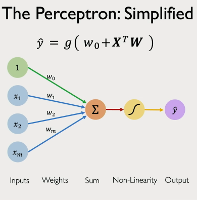

To create a neural network we can add the output nodes.

The outputs are different because each output node, though with the same input and activation function, has different weights.

## Neural network

### Creating a dense layer from scratch

__Tensorflow__:   __Pytorch__: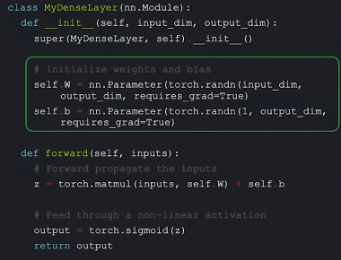

Normally though, all we need to do is call it.
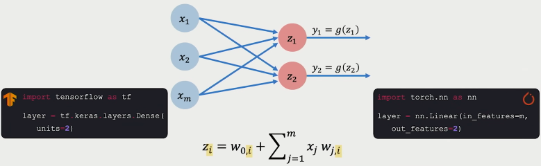

### Multi layer neural network(Deep neural networks)

This is a neural network with any number of  __hidden__ layers.
THe layers are hidden because we dont control the values in the layers.
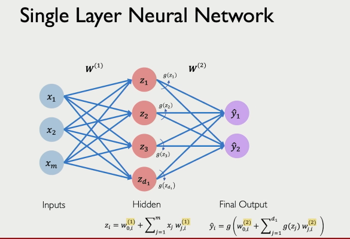
Each neuron in the hidden layer is a perceptron

To build a neural network:

In deep neural networks  the output is formed by a deep combination of linear followed by nonlinear functions.

THe more complex the task, the deeper the neural network should be.

## Applying neural networks

### Loss

- This is the measure of the cost incurred from incorrect predictions
  
  THe smaller the loss the better the neural network.
  __Empirical loss__: measure of total loss over our entire dataset
  
  We want neural networks that minimise loss
  __Binary(Softmax) crossentropy loss__: can be used with models that output a probability between 0 and 1:
  Ite measures the distance between two probability distributions
  
  __Mean squared error loss__: used with regression models that output continuous real numbers.
  it measures the distance between the predicted number and true number.
  

### Training neural netwrks

Ultimately we want to find the network whose weights _achieve the lowest loss_
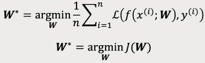
Our aim is loss minimisation.

#### Loss optimisation

The loss function is just a function of our weights
If we only had two weights we can plot them and see which configuration gives the lowest loss:

In the above landscape we want to find the lowest point(which weight configuration give the lowest loss)
Process:

    Randomly pick an initial starting position$(W_0, W_1)$
        Compute the gradient(which way is up locally)
        Take a small step int the opposite direction of gradient.
The above algorithm is known as __Gradient descent__

The process of computing the gradient is called __Back propagation__

#### Back Propagation

How does a small change in one weight affect the final loss?

We can write out the derivative and use the chain rule to decompose it:
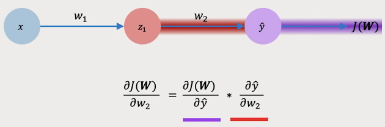
If we want to do the same thing for W1
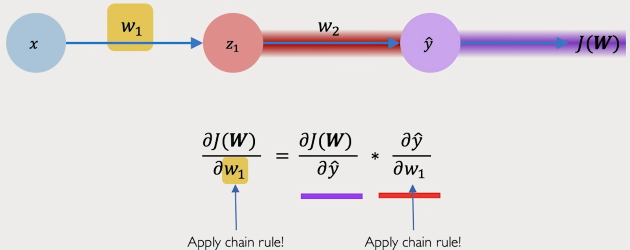

We start from te output and keep computing the iterative chain rules till we get to  the beginning.
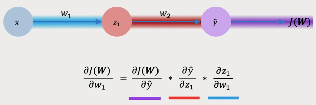
We repeat this for every weight in our netwrk using gradients from later layers.

- Back propagation is basically an application of the _chain rule_ from _differential calculus_

### Neural netwiorks in practice

#### 1. Optimisation

 in reality training and optimising neural netwirks is difficult and takes alot of compute.
 Here is a plot of some real world data.
 

Optimisation through gradient descent is done as follows:

Now we focus on the learning rate:

- learning rate dictates how quickly we take the steps and how quickly we learn from our gradients.
__Small learning rates__ = slow convergence and gets stuck in false local minima
__Large learning rates__ = overshoot, unstable learning and divergence
__Stable learning rates__ = smooth convergence and avoids local minima

To best optimize learning rates is by building _adaptive algorithms_ that adapt the learning rate to the landscape
This means learning rate isn't fixed but can be changed according to the following:
    - how large the gradient is
    - how fast learning is happening
    - weights etc

Here are a few adaptive learning rate algorithms:

In summary:
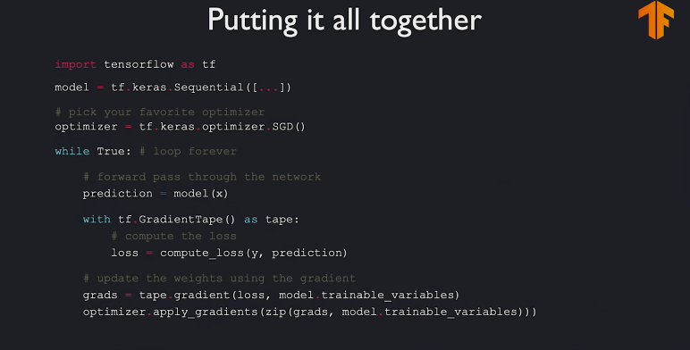

### 2. Mini batches

#### Stochastic gradient descent algo

Gradient descent is computed as a function/average of all data points in the data set which can be very computationally intensive. (we compute the gradient of all data points not just one.)

Instead we can use __stochastic gd__:
Here instead of computing the gradient over all data points we compute it from one data point.
Though this is way noisier we save on time and compute but we sacrifice accuracy in the process.
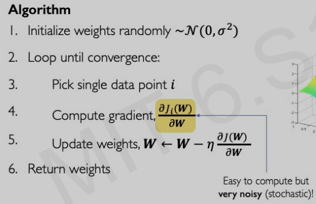
The middle ground here is mini-batch gradient descent.
Here we use mini batches to compute our gradient thus eliminating the inefficiency of vanilla gradient descent and the noise/inaccuracy of the stochastic gradient descent.

### Mini batches while training

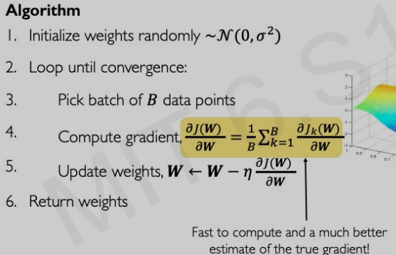

- More accurate gradient estimation
- Smoother convergence
- Larger learning rates

The relationships between gradients and learning rates is extremely connected.
_With more stable gradients, we can begin to take bigger steps.
With minibatches we can also parallelise traning achieving higher speeds by utilising GPUs_

### Overfitting

In model training we dont want our models to work extremely well only on our training sets but also to generalise to our testing set.

Overfitting is the problem where an algorithm learns the data too well which may lead to it just saving the data to memory rather than learning the patterns.
How well the model perorms on a trainig set is used as a proxy for how well it will work on real time data.

- As a "by the way" your model's complexity should match the complexity of the patterns you want to extract from your data and shouldn't be too complex or too simple.

### Regularisation

This is a technique used to improve our model's generalisation to real world and unseen data.

#### Dropout

This is where during training we randomly set some node's activations to 0
Tipically we drop 50% of each layer
This forces the network not to rely on any 1 or more nodes.

#### Early stopping

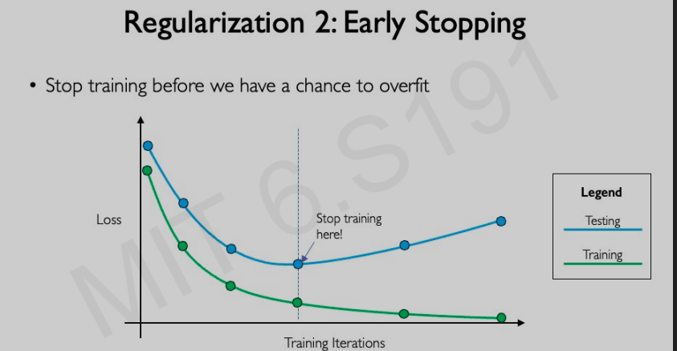
This is where we monitor the deviation between our training loss and testing loss and we stop training before we have a chance to overfit.
When the deviation increases we stop training.

## Deep sequence modelling

In sequence modelling we give an agent a past history of an object/ subject and tell it to predict where the thing is going next.
This is mostly done with data that occurs sequentially like speech, text, images and music etc

Sequential data like text can be split up into chunks called tokens.
These can vary in size from single character, words or even phrases being used as tokens to tranin different models.

### Sequence modelling applications

Here instead of binary classificatin which is one to one
We may have :
sentiment analsis -> many to one classification
Image captioning -> one to many
machine translation -> many to many

### Neural networks with recurrence

We can simplify the perceptron into the following:

This forms a neural network with multiple inputs and outputs and hidden layers:

This can be simplified into the following:

Which can be translated vertically:
Thus timesteps can be added for sequential data due to the inherent dependence between each sequence of the data.
We want the networks internal computations at eah individual timestep to prior computations of the previous timesteps.
We want to feed forward this information to each subsequent timestep
This is done as follows:
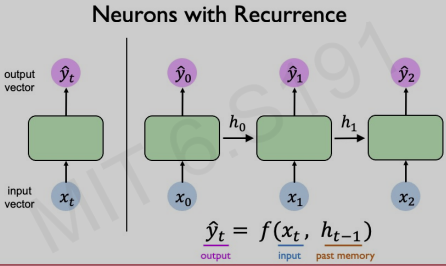
THe state h is passed onwards from timestep to timestep.

- The output produced is a function not only of the current inputs but also the previous states in the sequence.
- Recurrence can be simplified into the following image:

### Recurrent neural networks
