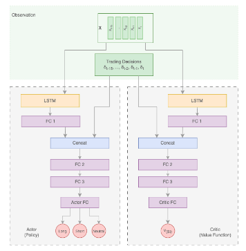

# FOREX MODEL BY RAMSEY NJIRE

This is a full documentation of me developing my fx model.
Its not gonna be easy but i must make it work.

## What am i trying to solve?

I got into ai because i couldnt control my emotions on the market.
The analysis i did was good, but my emotions got in the way.
My plan is to build an AI model that can:
    - gauge trade sentiment from online articles.
    - Gauge market directions by learning from market data.
For now those are my only goals.
Due to the ability of AI models to find complex relations in data, and the rapid advancement in this field giving the ai even more power, i want to develop a system that understands the market and can work as a professional analyst and portfolio manager.

## How do i go about this

1. Find historical forex data that i can train my model on.
2. Develop a model that can use this data to predict market trends.

### Finding the historical data

Im looking for free/ cheap forex historical data from the last 10 - 15 years.
I want to mainly focus on Gold (XAUUSD) and (EURUSD).
I asked chat gpt for sources.
[Histdata](HistData.com)
[Dukascopy](https://www.dukascopy.com/swiss/english/marketwatch/historical/)

I got my data from dukascopy

### Data

I downloaded 3 timeframes of data.
Daily, Hourly and minute
THe data is in csv format with 6 categories:
    Local time
    open
    high
    low
    close
    vlume

- Each candle has a specific volume that was traded.

## Ideas

- I can train different models for each timeframe, take their predictions as input into a different model which can take each timeframe and the news sentiment analysis and give a final bias prediction.

## Research

I went through a couple of research papers to see how other people have used AI and ML in forex market analysis.
In the following sections i will be breaking down my findings and thus create a hypothesis of the model i will go ahead with testing the various methodologies experimenting with different combinaions till i find one that performs well.

THe models i found being used most were LSTM(long short term memory) algorithms and CNNs(convolutional neural networks).
THe approach most used was deep learning.
In the following sections is a summary of my findings with the respective papers.

### A Deep reinforcement learning approach for trading optimization in the  forex market with multi-agent Asynchronous Distribution by Davoud Sarani and DR. Parviz Rashidi Khazaee

I intend to compare this paper with the one that follows.FInd it below.
Reference: the full paper is available on my github. [DRL](https://github.com/toxxicblood/learning/blob/main/AI/playground/DRL%20multi%20agent%20for%20different%20timeframes.pdf)

This research is a look into the application of a _multi-agent reinforcement learning framework wit hthe Asynchronous Advantage Actor-Critic algorithm_(__MA+RL+A3C__)

This method employs parallel learning across multiple asynchronous workers, each specialised in trading multiple currency pairs exploring potential or nuanced strategies.

This model outperforms _Proximal Policy Optimisation_

- The problem with having an algorithm trade is the long term delayed rewards.

- In forex data analysis we can either use single or multiple agents to learn the data.
- Here i will focus on using _multi agent_ methods because there is proof that they outperform single agent algorithms:
  - In multi agent algos, the independent agents are specialised in various time periods and they communicate through a hierachical mechanism, aggregating the intelligence across different timeframes to resist noise in financial data and improve trading decisions.
- I can also employ a __supervisory agent__ that selects the most promising trading reccomendations from the independent agents.

There are different parallel multi-agent algorithms like : __A3C, IMPALA and SeedRL.

- In this study, they went with the A3C algorithm because of it's enhanced computational efficiency , reduced training time adn effectiveness in environment exploration learning an iproved policy in less time.
- The A3C algo outperformed the others in training time and profitability.

When implementing only distill profitable trading decisions to students. using distributd computing.

When implementing these models it's good to note that a major drawback or Deep Learning is its time consuming learning mode which could be mitigated by employing distributed cloud computing.

- Another approach is multi-agent DRL algo with trend consisitency regularization.
- Also you can employ teacher agents to diverse sub environments to diversify learned policies , the student agents then utilize profitable knowledge from these teachers to emulate existing trading strategies.
- Reward shaping based on prices for forex trading with DRL using PPO algorithm enhancing agents performance in : profit, sharpe ratio and max drawdown.(market wide approach)

Utilizing DQN and A3C algos with SDAEs and LSTM networks:
    - Specifically the _SDAEs-LSTM A3C model learns a better strategy and surpasses lstm.

- In this research they focused on A3C and PPO to train a RL agent capable of executing trades in the markets

#### Algorithms

__Actor-Critic__:

- The _actor_ learns a policy(strategy)
- The _critic_ estimates the expected furture reward and reduces variance by providing a baseline for advantage estimates

__Advantage Function__:

- this function is used to compute the policy gradient.
- It quantifies how much better or worse a particular action is compared to the average action.
- Guides the actor to select actions with better outcomes
- Adresses credit assignment problem by providing feedback on quality of chosen actions.
- Calculated as:
    $A(sa) = Q(sa) - V(s)$
  - Where:
    - _Q-Value(action value)_ = expected cumulative reward from a particular action and policy
    - _V-Value(critic value)_ = expected cumulative reward from a particular state onwards using a policy x

__Proximal Policy Optimization(PPO)__:

- This is an _on-policy RL algorithm_ that optimizes the agent's policy to maximize expected cumulative reward.
A good way to explain this is to imagine you are playing a game. In this game you try different moves, some moves get you points, others dont.
What PPO does is like a coach, it watches how you play then gives hints on what moves you should try next making sure it's not too adventurous.
- It iteratively collect data through environment interactions and updating the policy for performance improvement.
- Basically it optimizes and improves the policy by looking at the state.
- Maintains a probability distribution over actions for each state repped by a Neural Network.
For better understanding, think of the policy as your game plan(described by a Neural Network) that tells you how to move.
When you play the gam, you try different moves. Good moves give you points others dont.
The PPO algo collects __all__ information from your plays and learns which moves lead to a win.
From this collected data, instead of making full game plan changes, it adjusts the plan in a small way, like making a duck instead of a dive. Or jumping a lil higher.

- The algo computes the surrogate objective to guide policy gradien for actions with higher returns and the clipped objective to limit policy updates to maintain stable training
The clipping function ensures the changes/updates are small so the new game  plan isn't too different from the old one
- It adresses the issues of high variance and unstable learning through policy update constraints.
- It also creates a balance between exploration and exploitation by policy optimization through data.
It makes sure you dont just stick to the same moves you know, but explore new ones too, making you better at the game over time.
- The loss is calculated as follows:
    $𝐿(𝜃)=𝔼𝑡 [𝑚𝑖𝑛(𝑟𝑡(𝜃)𝐴̂𝑡,clip(𝑟𝑡(𝜃),1−𝜖,1+𝜖)𝐴̂𝑡)−𝛽ℋ(𝜋𝜃(⋅|𝑠𝑡))]$
    $𝑟𝑡(𝜃)= 𝜋𝜃(𝑎𝑡|𝑠𝑡)/𝜋𝜃old(𝑎𝑡|𝑠𝑡)$

    Where:
        - __$clip(x,a,b)$__ = a clipping function that clips the value $x$ to the range $[a,b]$.
        - __$ℋ(𝜋𝜃(⋅|𝑠𝑡))$__ = represents entropy of the policy
        - __$𝑟𝑡(𝜃)$__ = ratio of probability of new policy to the old policy.

__Asynchronous Advantage Actor-Critic(A3C)__:

- This is an advanced variant of the Actor-Critic architecture.
- The advantage in this algo refres to the advantage function
- In A3C, multiple local workers run in parallel with their copy of the policy network and environment, collecting experiences and updating global networks asyncrhonously enabling efficient resource utilization, faster convergence , better exploration and more sample-efficient learning.
This can be related to being in a gaming group with your friends, all playing the same game level.
In this algorithm, there are many _"worker agents"_ (like players) that each try out different moves/strategies __independently__
After each attempt in the level("environment") they update a global network(like a group strategy) on their experiences wether good or bad, helping create a better/the best plan to beat the level.

- Accumulate gradients with respect to local policy network parameters $𝜃′$ using policy gradient and advantage estimation are calculated as:
    $𝛻𝜃′𝑙𝑜𝑔𝜋(𝑎𝑖|𝑠𝑖;𝜃′)(𝑅−𝑉(𝑠𝑖;𝜃𝑣′))$
With:
  - $𝜃′v = 𝜕(𝑅−𝑉(𝑆𝑖;𝜃𝑣′))2/𝜕𝜃𝑣$
    - This is how accumulated gradient are calculated with respect to local value network.
    - THis is done using the squared temporal difference error.
    - $(𝑅𝑡 −𝑉(𝑠_𝑡))$ = the difference between the estimated value $V(s_t)$ and the observed reward $R_t$
    - THe $$𝜕/𝜕𝜃_𝑣′$  = the partial derivative with respect to the parameter $𝜃_𝑣′$ and is used to show how small a change in this parameter affects the expression.
  - R is the total discounted return
  - $𝑅 ←𝑟𝑖 +𝛾𝑅$
    - $r_i$ = immediate reward at time step $i$
    - $𝛾$ = discount factor to dicount values of furture rewards
- The __Policy loss(actor loss)__ for the N time steps in A3C is computed as:
  $𝐿policy =−1/𝑁 *∑^N𝑡=1𝑙𝑜𝑔𝜋(𝑎𝑡|𝑠𝑡)⋅𝐴𝑡$
- The __Value loss(critic loss)__ guides the value function towards better approximations of the expected return (R).
  - It is the mean squared error between the estimated value function (V) and actual return.
  - THe value loss for N time steps is calculated as:
        $𝐿critic = 1/𝑁∑^N𝑖=1(𝑅𝑖 −𝑉(𝑠𝑖;𝜃𝑣))^2$

In the asynchronous updating process of the global worker from local workers, the global network aggregates gradients from multiple local workers and updates it's parameers, while each local worker updates it's parameters independently based on its local experiences.

- The async update for the actor can be defined as follows:
    $𝜃^′:𝑑𝜃 ←𝑑𝜃+𝛻𝜃^′𝑙𝑜𝑔𝜋(𝑎𝑖|𝑠𝑖;𝜃^′)(𝑅−𝑉(𝑠𝑖;𝜃^′v))$

- And therefore as follows for the critic:
    $𝜃^′v:𝑑𝜃𝑣 ←𝑑𝜃𝑣 +𝜕(𝑅−𝑉(𝑠𝑖;𝜃^′v))2/𝜕𝜃^′v$

  - Assuming the $𝜃$ and $𝜃v$ are the shared params of the global worker , $𝜃^′$ and $𝜃^′v$ represent local worker params based on the S3 algorithm.

Imagine two different players at each gaming setup.(one play station per pair)
They each have a different role let's call them Player 1 and player 2:
__THe actor__: this is player 1. He decides the moves to make(actively playing)
__The critic__: this is player 2. He is  more experienced in the game and watches player 1. He tells player 1 if the moves he makes are good or bad(critiques moves) thus helping player 1 improve his strategy.

__Asynchronous workers__: A3C lets many teams of this player 1,2 combo to work at the same time.
Each team interacts with the same game(learns the environment) at their own pace.
Later they share their best tips with the whole group, thus supercharging the group's learning.
With these lessons they update the __global plan__ which gets better with each update from each team.

#### Methodology

__Data Preparation__:

- Time frame = H1

- Due to price fluctuations and recurring patterns, using raw candlestick data is inefficient.
- To mitigate this, the follwoing method is used.
$𝑥1𝑡=𝑃𝑐𝑡−𝑃𝑐𝑡−1/𝑃𝑐𝑡−1
𝑥2𝑡=𝑃ℎ𝑡−𝑃ℎ𝑡−1/𝑃ℎ𝑡−1
𝑥3𝑡=𝑃𝑙𝑡−𝑃𝑙𝑡−1/𝑃𝑙𝑡−1
𝑥4𝑡=𝑃ℎ𝑡−𝑃𝑐𝑡/𝑃𝑐𝑡
𝑥5𝑡=𝑃𝑐𝑡−𝑃𝑙𝑡/𝑃𝑐𝑡
𝑋𝑡=[𝑥1𝑡,𝑥2𝑡,𝑥3𝑡,𝑥4𝑡,𝑥5𝑡](9)
𝑋=[𝑋𝑡−𝑤𝑖𝑛𝑑𝑜𝑤,...,𝑋𝑡−2,𝑋𝑡−1,𝑋𝑡](10)$
- This method utilizes the ratio of candlestick changes from ts data to create 5 new features.

__Reward function__:

- Agent evaluation carried out through rewards from the environment.
- Through interacting with the environment, the agent receives rewards based on the decision it made :
  - Profitable = +ve reward
  - Loss = -ve reward.
- THe received reward is a normalized value determined by  the price changes in consecutive candlestick closing prices within 2 successive time intervals.
$𝑧𝑡=𝑃𝑐𝑡−𝑃𝑐𝑡−1 / 𝑃𝑐𝑡−1$

- Value is as follows($𝛿_𝑡$):
  - 1 -> long trade
  - -1 -> short trade
  - 0 -> position exit or staying out
THus:
$r_t = 𝛿_t * z_t$
- The primary objective of this work is to highlight training time efficiency and optimal policy learning.
- Assumptions made:
  - No commissions
  - No spread
- Rewards calculated based on closing price

----
__Proposed RL model__:

The main interaction is btw the agent and environment.

- _Observation space_:
  - prepping historical financial market data
    - $𝑋=[𝑋𝑡−𝑤𝑖𝑛𝑑𝑜𝑤,...,𝑋𝑡−2,𝑋𝑡−1,𝑋𝑡]$
  - Trading decisions made within specified past window tf categorised into:
    - Opening long
    - Opening short
    - Closing existing
    - Staying out
- _Action space_: interacting with received trading decisions.

Agent receives observation state, makes trading decision and receives a reward from the environment based on profit or loss

_Model Structure_:

A uniform NN model was used for both algorithms. The model's  input  consists  of  two  parts:  the  first  part  contains  an LSTM layer for normalized time series data(10), and the second part is  a  linear  layer  for  the  one-hot  encoded  trading  decisions made within a chosen time interval of a specific window size.The number of neurons in the hidden LSTM layer is set to 128, The  output  from  the  LSTM  is  first  passed  through  a  layer consisting  of  32  neurons.  Then,  it  is  combined  with  the  trading decisions from  previous  steps,  based  on  window  size, and  fed into a fully connected (FC) layer.The  output  from  the  previous steps  is  combined  and  sent  to a FC layer with 64 neurons. This FC layer then sendsthe output to either  an  actor  or  critic  FC  layer,  depending  on  whether  it's  for trading  decisions  or  evaluation.  The  actor  FC  layer's  output represents the number of trading decisions made, while the critic FC layer's output is used to evaluate the actor's performance

Actor critic scheme.

Data obtained from Mt5

__Evaluation Metrics__:

_Return_ : strategy's profitability = $((final price - Initial price) / initial price ) * 100$
_Sharpe ratio_ : risk vs return =  $𝑅_𝑝 / 𝜎_𝑝$
  𝑅𝑝 = returns
  𝜎𝑝 = standard deviation of returns
_Profit factor_  : money made vs lost
_Max Drawdown_ : largest loss

__Parameters__:

- _Discount factor_ = 0.99
- _Learning rate_ = 0.00004
- _Time window_ = 16

__F. Multi-Agent training(MA)__
TheMA training  process  follows  the  same  parameters  and conditions as SA. Five local workers are employed for parallel training  to  speed  up  the  learning  process.  Each  local  worker undergoes 20 training steps before updating the global worker. This  process  continues  until  the  end  of  one  episode,  after which a new episode begins.During the training with A3C, two different approacheswere examined.    In    the MA-Lock,    a    lock    mechanism    was implemented,  which  allowed  only  one  local  worker  at  a  time to make updates to the global worker. the MA-NoLockdidnot have  a  locking  mechanismandmultiple  local  workers  could interact  with  the  environment  and  concurrently  share  updates with   the   global   worker   without   any   conflicts.   Also,   an optimizer  with  shared  parameters  was  implemented  across  all workers

Ma- Lock outperformsa

## Project structure

project/
├── data/
│   └── forex.csv          # your raw CSV
├── src/
│   ├── envs/
│   │   └── multi_tf_env.py
│   ├── agents/
│   │   └── dqn_agent.py
│   ├── train.py
│   ├── evaluate.py
│   └── utils.py
└── notebooks/
    └── exploration.ipynb  # optional EDA + viz

## Project progress notes

### Project setup

- Downloading the required libraries and other dependencies.

### Data preprocessing

- Loading the data into my working memory and parsing the dates.
- I use pandas for this.
- Also splitting the data into training and testing data with training data from 1-1-2020 to 30-6-2024 and testing data spanning 1-7-2024 to 30-4-2025
- That is training data spanning 4 years and testing data spanning 10 months..
- The dates are adjusted for a GMT+3 timezone meaning its adjusted for nairobi.
- Im going to be using XAUUSD data to see how the algo performs on Gold.
- Im also going to include multiple timeframes but i will add this feature later.
- I calculated the five features as shown in the paper.

### Gym env

I want to create a single tf env with multitimeframe wrappers

- This is the reward function.
- 
